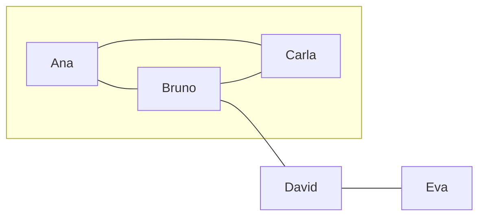
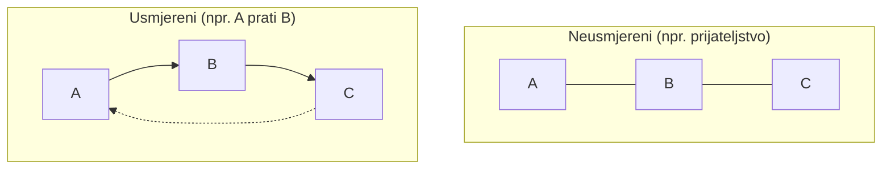
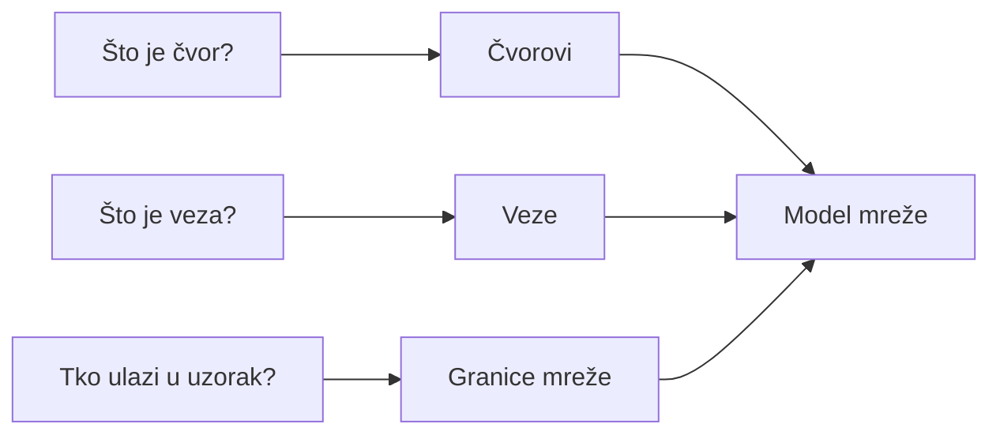
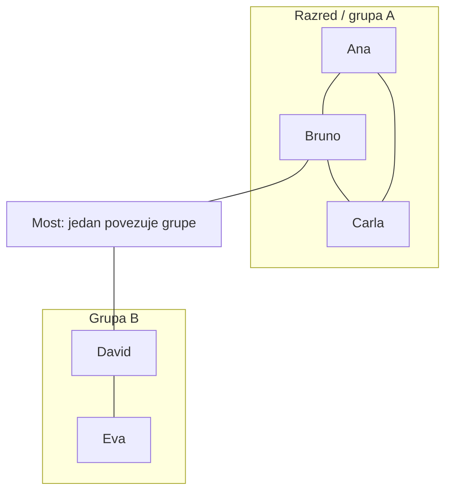
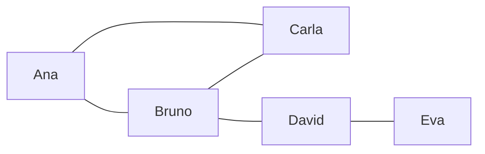
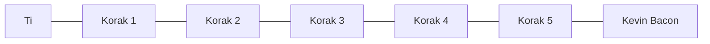

# 1. Uvod u društvene mreže i teoriju grafova

Svaki dan živimo unutar nevidljivih mreža: ljudi koje poznajemo, institucije s kojima surađujemo, grupe u kojima sudjelujemo. Te veze nisu nasumične — oblikuju naše mogućnosti, širenje informacija i način na koji se kultura i moć raspodjeljuju. Istraživanje društvenih mreža (SNA) pruža jezik i alate da te odnose pretvorimo u pregledne strukture: grafove čvorova i veza koje možemo mjeriti, uspoređivati i tumačiti. Ovo poglavlje uvodi te osnove — od svakodnevnog iskustva do formalnog aparata teorije grafova — kao temelj za sve što slijedi u kolegiju.

**Ilustracija:** Jednostavan graf društvene mreže — čvorovi (akteri) i veze (odnosi). Trokut (Ana–Bruno–Carla) i „most” prema Davidu i Evi prikazuju tipičnu strukturu: grupa + povezivač.

*Graf s čvorovima i bridovima: isti tip strukture koristit ćemo u bilježnici za izgradnju i vizualizaciju.* Isti primjer u [bilježnici](../code/01_uvod_grafovi_networkx.ipynb).

---

## Teorijski koncept

Društvene mreže nisu samo metafora; one su sustavi u kojima entiteti (pojedinci, organizacije, stranice, hashtagovi) ostvaruju odnose. Teorija grafova daje matematički okvir: mrežu predstavljamo kao **graf** sastavljen od **čvorova** (akteri) i **veza** (odnosi). Time društveno-kulturni fenomeni — tko s kime surađuje, tko koga prati na društvenim mrežama, kako se vijest širi — postaju analizabilni: možemo govoriti o „središnjim” ili „rubnim” čvorovima, o gustoći veza, o putovima između ljudi. Poglavlje stoga uvodi ne samo pojmove nego i način razmišljanja: kako prepoznati mrežu u stvarnosti i zašto nam njezina struktura nešto govori o društvenom životu.

---

## Definicije

Da bismo mogli precizno govoriti o mrežama, koristimo ustaljene termine:

- **Društvena mreža**: Sustav u kojem su entiteti (osobe, organizacije, grupe) međusobno povezani različitim vrstama veza — prijateljstva, suradnja, zajednički interesi, sljedbenici, razmjena poruka. Mreža je dakle i konkretni skup ljudi *i* skup njihovih odnosa.
- **Čvorovi (nodes)**: Jedinice koje analiziramo; u društvenom kontekstu to su najčešće pojedinci ili organizacije, ali mogu biti i stranice, hashtagovi, knjige — ovisno o istraživačkom pitanju.
- **Veze (edges)**: Odnosi koji spajaju čvorove. Mogu biti simetrične („A i B su prijatelji”) ili usmjerene („A prati B”).
- **Mrežna struktura**: Način na koji su čvorovi i veze raspoređeni — tko je s kim povezan, ima li mreža jasna „jezgra” i „periferija”, postoje li grupe koje su međusobno slabo povezane. Ta struktura utječe na komunikaciju, pristup informacijama i društveni utjecaj.
- **Graf**: Matematička struktura: skup čvorova i skup bridova (veza) između njih. Formalizacija omogućuje računanje i usporedbu.
- **Neusmjereni graf**: Veze nemaju smjer; npr. „A i B se poznaju” je isto što i „B i A se poznaju”. Tipično za prijateljstva, suradnje.
- **Usmjereni graf**: Veze imaju smjer; npr. „A prati B” nije isto što „B prati A”. Važno za sljedbenike na X/Twitteru, citiranja, tok informacija.
- **Težinski graf**: Na svakoj vezi stoji broj ili intenzitet — npr. broj poruka između dvoje, snaga odnosa. Omogućuje razlikovanje „jačine” veze.

Ove definicije vraćat će se kroz cijeli kolegij; ovdje ih postavljamo kao zajednički rječnik. **Korak-po-korak izrada grafa** (čvorovi, veze, crtež) nalazi se u [01_uvod_grafovi_networkx.ipynb](../code/01_uvod_grafovi_networkx.ipynb).

**Ilustracija — čvorovi i veze: neusmjereni vs usmjereni graf.**

*Neusmjereni graf: veza je obostrana. Usmjereni: strelice označavaju smjer odnosa.*

---

## Ključni istraživači

Razvoj područja dugujemo nizu autora čija su imena povezana s određenim konceptima i metodama:

- **Stanley Wasserman i Katherine Faust** objavili su 1994. klasičnu knjigu *Social Network Analysis: Methods and Applications*, koja i danas služi kao temeljna referenca za definicije mjera, prikupljanje podataka i interpretaciju. Njihov sustavni pregled omogućio je da SNA postane prepoznatljiva metodologija u sociologiji, antropologiji i srodnim disciplinama.
- **Albert-László Barabási** unio je u raspravu ideje iz fizike složenih sustava: bezskalne mreže, preferencijsko povezivanje, „hub” čvorovi. Njegova knjiga *Network Science* (dostupna i online) i hrvatsko izdanje *U mreži* (Naklada Jesenski i Turk, 2006.) pomažu da se razumije zašto neke mreže imaju malo vrlo povezanih čvorova i mnogo slabije povezanih — što ima izravne posljedice za širenje informacija i utjecaj.
- **John Guare** nije znanstvenik nego dramatičar; njegova drama *Six Degrees of Separation* (1990.) i kasnija „igra” Šest stupnjeva Kevina Bacona popularizirali su ideju da su ljudi na svijetu međusobno povezani kroz kratke lance poznanika. Ta ideja ima i empirijsku podlogu (eksperimenti s pismima, kasnije Facebook i druge platforme) i postala je dio svakodnevne kulture.

Poznavanje tih imena i njihovih doprinosa pomaže pri čitanju literature i stavljanju vlastitih analiza u kontekst.

---

## Recentna literatura

Da biste ostali u tijeku s razvojem područja, posebno s primjenama na online mrežama i suvremenim alatima, korisno je obratiti se novijim izvorima:

- **Barabási, A.-L. (2016).** *Network Science*. Cambridge University Press. Besplatno dostupno online: [http://networksciencebook.com/](http://networksciencebook.com/) — uključuje i primjere i vizualizacije.
- **Borgatti, S. P., Everett, M. G., & Johnson, J. C. (2018).** *Analyzing Social Networks*. SAGE. Praktičan vodič s naglaskom na interpretaciju i korištenje softvera.
- Preporučuje se preferirati izdanja i članke od otprilike 2015. nadalje kada je riječ o primjerima s društvenim medijima, API-jima i Pythonu (NetworkX, pandas), jer se platforme i alati brzo mijenjaju.

---

## Problemi

Već na početku treba biti svjestan ograničenja i otvorenih pitanja:

- **Granice mreže**: Tko ulazi u uzorak? Ako proučavamo razred, uključujemo li samo studente ili i nastavnike? Ako proučavamo hashtag na Twitteru, gdje prekidamo prikupljanje? Odluka o granicama izravno utječe na sve brojke i zaključke.
- **Stvarna veza nasuprot platformskoj**: „Prijatelj” na Facebooku nije nužno bliska osoba u životu; broj sljedbenika ne mjeri nužno stvarni utjecaj. Treba jasno razlikovati operacionalnu definiciju veze (što smo zapravo izmjerili) od svakodnevnog značenja riječi.
- **Metodološka ograničenja**: Ankete ovise o iskrenosti i pamćenju ispitanika; API-ji društvenih platformi ograničavaju što i koliko možemo dohvatiti. Rezultate treba čitati u svjetlu tih ograničenja.

Ova pitanja vraćat će se u poglavljima o prikupljanju podataka, online mrežama i etici.

**Ilustracija — odluke pri definiranju mreže.**

*Odluke o čvorovima, vrstama veza i granicama uzorka određuju što ćemo analizirati.*

---

## Primjer u stvarnom svijetu

Da koncepti ne ostanu apstraktni, evo nekoliko situacija u kojima se prirodno nameće mrežni pogled:

- **Graf prijateljstva** u razredu ili na fakultetu: tko s kime najčešće radi, druži se ili razmjenjuje bilješke. Čvorovi su studenti, veze su „prijateljstvo” ili „suradnja”. Takav graf može otkriti grupe, izolirane pojedince ili „mostove” između grupa.
- **Graf obitelji**: čvorovi su osobe, veze su rodbinski odnosi. Koristi se u genealogiji, proučavanju nasljedivanja ili podrške unutar obitelji.
- **Mreža profesionalnih kontakata** na LinkedInu: tko je s kime povezan u struci. Često se analizira za razumijevanje karijernih putova ili pristupa informacijama o poslovima.
- **Internetske zajednice**: forumi, grupe na društvenim mrežama, wikiji. Čvorovi su korisnici (ili tema/thread), veze su komentari, oznake „prijatelj”, zajednička sudjelovanja. Ovakve mreže omogućuju proučavanje formiranja normi, konflikata ili difuzije inovacija unutar zajednice.
- **Filmovi i serije:** „Šest stupnjeva Kevina Bacona” — čvorovi su glumci, veze su zajednički film. MCU (Marvel Cinematic Universe): likovi povezani filmovima, „most” između franšiza (npr. Nick Fury). *Game of Thrones*: mreža saveza i sukoba između kuća.
- **Gaming i streaming:** Discord serveri, Twitch/YouTube kolaboracije — tko s kime igra ili streama; Among Us ili druge igre: tko s kime komunicira u rundi.

U svakom od tih slučajeva istraživač mora odlučiti što će biti čvor, što veza i kako će granice mreže biti definirane.

**Ilustracija — primjer mreže s grupama i mostom.**

*Jedan čvor (most) povezuje dvije grupe — tipičan rezultat u analizi prijateljstva ili suradnje. U kodu: [01_uvod_grafovi_networkx.ipynb](../code/01_uvod_grafovi_networkx.ipynb), Korak 1 i 2.*

---

## Kulturologija i komunikacijski/društveni problemi

Mrežni pristup nije samo tehnička metoda; on je pogodan za pitanja koja zanimaju kulturološke i komunikacijske studije. Naime, identitet, moć i širenje informacija često ovise upravo o položaju u mreži: tko ima pristup kome, tko prenosi novosti, tko povezuje različite grupe. Antropologija, sociologija kulture, komunikologija i medijske studije koriste SNA za analizu institucija (muzeji, izdavaštvo), medijskih publika, aktivističkih mreža i kulturnih scena. U tom smislu ovo poglavlje nudi ne samo alat nego i način razmišljanja o društvenom i kulturnom životu kao o povezanim strukturama.

**Praktični primjer (detaljna bilježnica):** [examples/kulturologija_mreza_primjer.ipynb](../examples/kulturologija_mreza_primjer.ipynb) — analiza mreže likova iz *Les Misérables* (Victor Hugo): učitavanje podataka iz `examples/data`, obrada s **pandas** i **networkx**, interaktivna vizualizacija s **plotly**; interpretacija stupnja i betweenness centralnosti u smislu „središnjih” likova i „mostova” između grupa (identitet, moć, širenje informacija).

---

## Osnove teorije grafova i primjena u društvenim mrežama

Kad imamo graf — skup čvorova i veza — možemo izračunati brojke koje opisuju njegovu strukturu. U središtu su različite **mjere centralnosti**: na koliko načina je neki čvor „važan” ili „središnji”?

- **Stupanj centralnosti**: jednostavno broj veza koje čvor ima. Čvor s mnogo veza može biti „popularan” ili „dobro povezan”.
- **Betweenness centrality**: koliko puta taj čvor leži na najkraćem putu između drugih parova čvorova. Visok betweenness često označava „most” ili posrednika između grupa.
- **Closeness centrality**: koliko je čvor u prosjeku „blizu” svih ostalih (mala prosječna udaljenost). Može označavati čvora koji brzo može dosegnuti ostatak mreže.
- **Eigenvector centrality**: važnost čvora ovisi o važnosti njegovih susjeda. Popularan u kontekstu stranica na webu ili „utjecajnih” korisnika.

Te mjere ne govore isto; izbor ovisi o istraživačkom pitanju (npr. tko širi informacije vs. tko povezuje grupe). U kasnijim poglavljima detaljno ćemo ih računati i tumačiti. **U kodu:** u [01_uvod_grafovi_networkx.ipynb](../code/01_uvod_grafovi_networkx.ipynb) gradimo graf i vizualiziramo ga (Korak 1–2); računanje mjera centralnosti u [03_mjere_centralnosti_klasteriranje.ipynb](../code/03_mjere_centralnosti_klasteriranje.ipynb).

**Primjeri upotrebe:** identifikacija ključnih influencera u organizaciji ili online zajednici; analiza toka informacija — tko je u poziciji da „prenese” vijest cijeloj mreži ili između segmentata.

**Ilustracija — isti graf, različite mjere centralnosti.**

*Bruno može imati visok betweenness (most); Ana i Carla visok clustering. U bilježnici za pogl. 3 isti graf se crta s veličinom čvora = mjera.*

---

### Šest stupnjeva razdvojenosti

Jedna od najpoznatijih ideja povezanih s mrežama ljudskih odnosa jest da su gotovo sve osobe na svijetu međusobno povezane kroz kratak lanac poznanika — obično se govori o **šest ili manje koraka**. Koncept potječe iz ranih eksperimenata (Milgram i suradnici, 1960-ih), a u popularnu kulturu uveo ga je dramatičar **John Guare** u predstavi *Six Degrees of Separation* (1990.). Kasnije je nastala „igra” **Šest stupnjeva Kevina Bacona**: pokušaj povezati bilo kojeg glumca s Kevinom Baconom kroz zajedničke filmove u najviše šest koraka. Igra ilustrira ideju da su čak i u ogromnoj industriji povezanosti relativno kratke.

Za sociologiju i istraživanje društvenih mreža ta ideja ima dublji smisao: sugerira da smo društveno povezaniji nego što se čini, da akcije i odluke mogu imati posljedice i na one koje ne poznajemo izravno, i da „položaj” u mreži — koliko smo blizu ili daleko od drugih — može biti važan za pristup resursima, informacijama i utjecaju. U suvremenim online mrežama (Facebook, LinkedIn) mjerenja su potvrdila da su prosječne udaljenosti između korisnika često još manje od šest, što otvara pitanja o dezinformacijama, viralnosti i etici istraživanja takvih podataka.

**Ilustracija — lanac od šest koraka (šest stupnjeva).**

*Ideja: bilo koja osoba (ili glumac) povezana s ciljem u najviše ~6 koraka kroz poznanike (ili zajedničke filmove).*

**Vizualni primjeri** koji pomažu u intuiciji:

- [Osnovni graf](https://upload.wikimedia.org/wikipedia/commons/thumb/5/5e/Graph_theory_example.svg/1200px-Graph_theory_example.svg.png) — čvorovi i bridovi.
- [Graf s objašnjenjima čvorova i veza](https://upload.wikimedia.org/wikipedia/commons/thumb/2/24/Graph_visualisation_example.svg/1200px-Graph_visualisation_example.svg.png).
- [Vizualizacija širenja informacija](https://upload.wikimedia.org/wikipedia/commons/thumb/9/90/Information_network.svg/1200px-Information_network.svg.png).

**Zadatak:** Učitaj [Perak Network 1 (Colab)](https://colab.research.google.com/drive/10Zhk40bVdm4bGZS4AD7OrpPCbHP_2jx_?usp=sharing), napravi svoju kopiju i zabilježi napredak u [tablici praćenja](https://docs.google.com/spreadsheets/d/13FhOWAMGhvWzO5-B8PwR7ZR4IGTqE4C24b975o6EhQA/edit?usp=sharing).

---

## Od teorije do prakse: podaci, modeliranje, alati

Ovo poglavlje je uvodno; samu pripremu podataka, odluke o modeliranju (što su čvorovi, što bridovi) i korištenje programa (NetworkX, Gephi) obrađujemo u poglavljima 2 i 3. Važna poruka za kraj: formalni opis mreže — čvorovi, veze, mjere — nije samo tehnički korak. On omogućuje da hipoteze o društvenim i kulturnim procesima prođu kroz provjeru: možemo usporediti mreže, pratiti promjene u vremenu i diskutirati implikacije rezultata za razumijevanje zajednica, moći i komunikacije.

---

## Povezivanje sadržaj ↔ kod

| Što tražite | Gdje |
|-------------|------|
| Definicije (čvorovi, veze, graf, neusmjereni/usmjereni) | Ovaj dokument, odlomak **Definicije** |
| Korak-po-korak izrada grafa u Pythonu (NetworkX) | [01_uvod_grafovi_networkx.ipynb](../code/01_uvod_grafovi_networkx.ipynb), Korak 1–3 |
| **Kulturologija i komunikacijski problemi — praktični primjer** | [kulturologija_mreza_primjer.ipynb](../examples/kulturologija_mreza_primjer.ipynb); podaci u `examples/data/` |
| Konceptualni primjeri (stvarni svijet, šest stupnjeva) | Ovaj dokument, **Primjer u stvarnom svijetu**, **Šest stupnjeva** |
| Vizualizacija grafa (crtež, struktura) | Bilježnica, Korak 2 |
| Tablica stupnjeva čvorova | Bilježnica, Korak 3 |
| Uvod u mjere centralnosti (tekst) | Ovaj dokument, **Osnove teorije grafova**; računanje u pogl. 3 |
