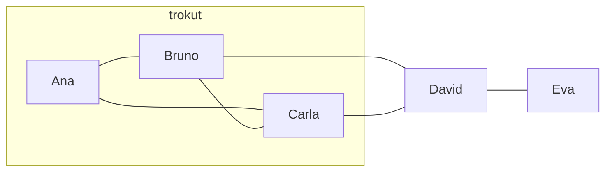
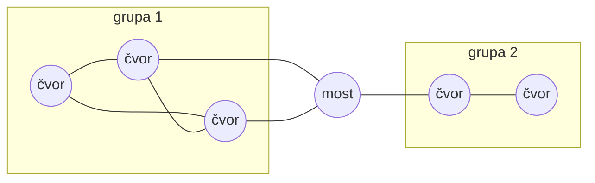
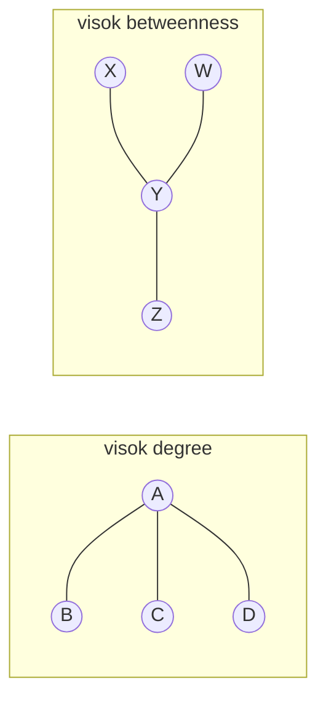
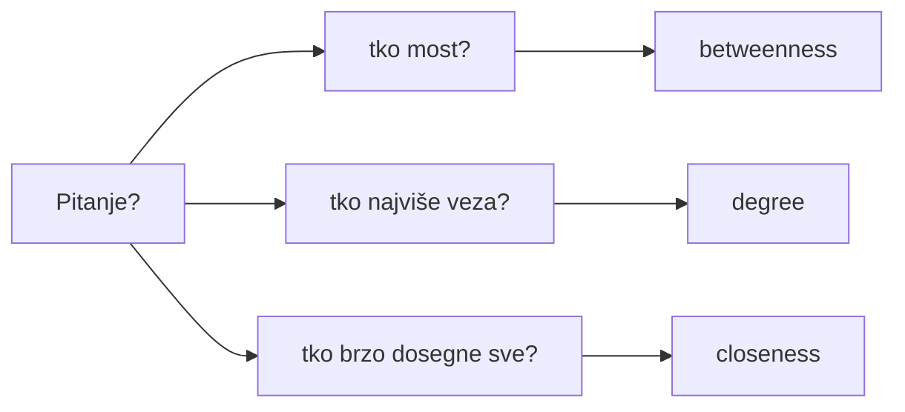
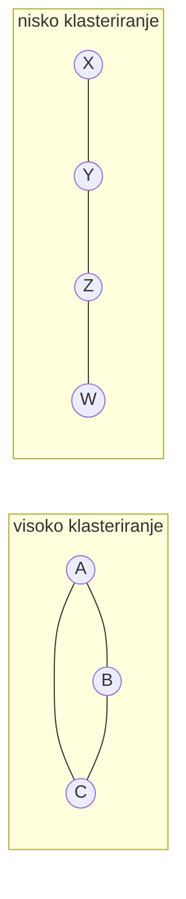
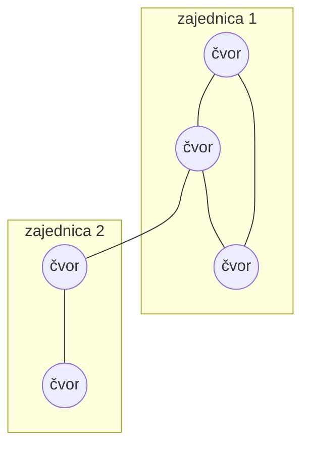
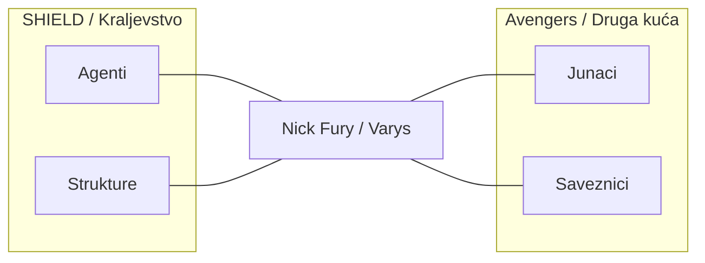
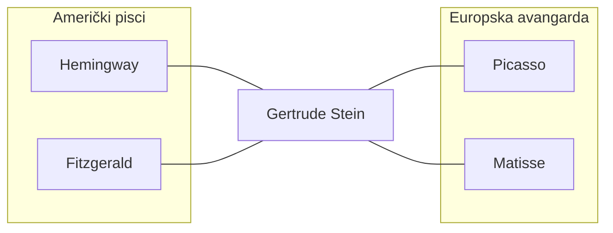
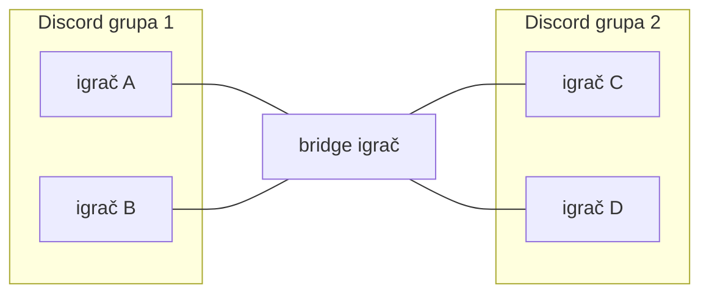

# 3. Mjere mrežne strukture i interpretacija rezultata

Kad imamo graf — listu čvorova i veza — sljedeći je korak **opisati** tu strukturu brojevima. Tko je „u sredini”, a tko na rubu? Koliko je mreža gusto isprepletena? Postoje li unutar nje jasne grupe? Odgovori na ta pitanja ne dolaze iz gledanja siluete grafa nego iz **mjera**: brojeva koje računamo za svaki čvor ili za cijelu mrežu. Ovo poglavlje uvodi glavne mjere — centralnost u njezinim različitim oblicima, gustoću i mjere klasteriranja — te objašnjava što svaka od njih zapravo mjeri i kako ih tumačiti u kontekstu društvenih i kulturnih pitanja.

**Ilustracija:** Primjer mreže koju koristimo u poglavlju — **trokut** (Ana, Bruno, Carla međusobno povezani) i **most** (David povezuje trokut s Evom). David ima visoku *posredničku centralnost* (betweenness); trokut ima visoko *klasteriranje*.

*Trokut = gusto povezana grupa (visoko klasteriranje). David = most između grupe i Eve (visok betweenness).*

*Isti graf računski i vizualno obrađujemo u [bilježnici](../code/03_mjere_centralnosti_klasteriranje.ipynb) — svaka mjera (degree, betweenness, closeness, eigenvector, klasteriranje) ilustrirana je crtežom.*

---

## Teorijski koncept

Mjere mrežne strukture služe da **kvantificiramo** svojstva koja inače samo intuitivno nazivamo: „važan čvor”, „gusta grupa”, „most između dva svijeta”. Formalno, to su indeksi izračunati iz grafa (broj veza, duljine putova, broj trijangala itd.). Različite mjere odgovaraju na različita pitanja: stupanj centralnosti govori o „popularnosti” ili broju direktnih veza; betweenness o tome tko leži na putovima između drugih i može kontrolirati protok; koeficijent klasteriranja o tome koliko su nečiji susjedi međusobno povezani. **Interpretacija** rezultata znači povezati te brojke s društvenim ili kulturnim fenomenima: npr. visok betweenness može sugerirati osobu koja povezuje različite zajednice i ima posebnu ulogu u širenju informacija. Bez jasnog razumijevanja što mjera mjeri, lako je pogrešno tumačiti brojke; stoga ovdje naglasak stavljamo i na definicije i na kontekst u kojem se mjere koriste.

*Ilustracija — tri intuitivna pojma koja mjere kvantificiraju: „važan čvor” (puno veza), „gusta grupa” (trokut), „most” (između grupa).*

*Gustina grupe 1 (trokut) vs grupa 2; most M povezuje obje → različite mjere (degree, betweenness, clustering) opisuju različite uloge.*

---

## Definicije

Da bismo mogli precizno govoriti o mjerama, evo osnovnog rječnika:

- **Čvorovi** i **veze**: Jedinice u mreži (ljudi, organizacije, stranice) i odnosi između njih. Mjere se računaju nad grafom koji se sastoji od tih čvorova i veza.
- **Gustoća**: Omjer broja stvarno prisutnih veza i broja *mogućih* veza (ako bi svaki čvor bio povezan sa svakim). Vrijednost između 0 i 1; viša gustoća znači da je mreža „gušća”, tj. da je veći dio mogućih veza ostvaren. Često se interpretira kao mjera kohezije ili integracije grupe.
- **Centralnost**: Opći pojam za „važnost” ili „središnjost” čvora. Postoji više načina da se ta važnost definira; stoga imamo više mjera centralnosti.
- **Stupanj centralnosti (degree)**: Broj veza koje čvor ima. U neusmjerenom grafu to je jednostavno broj susjeda; u usmjerenom razlikujemo ulazni i izlazni stupanj. Čvor s visokim stupnjem ima „puno veza” — što se u društvenom kontekstu često prevodi kao popularnost ili izloženost.
- **Težinska centralnost (weighted degree)**: Ako su na bridovima težine (npr. broj poruka), stupanj se može računati kao *suma* težina umjesto broja bridova. Time razlikujemo čvora s mnogo slabih veza od čvora s manje, ali intenzivnijih veza.
- **Blizinska centralnost (closeness)**: Mjeri koliko je čvor „blizu” svih ostalih — obično kao recipročna vrijednost prosječne duljine najkraćeg puta do svih drugih čvorova. Čvor s visokom blizinskom centralnošću može brzo „dosegnuti” ostatak mreže ili biti brzo dosegnut; korisno za pitanja o brzini širenja informacija.
- **Posrednička centralnost (betweenness)**: Za svaki par drugih čvorova računamo najkraće puteve između njih; betweenness čvora je udio tih puteva koji *prolaze* kroz taj čvor. Visok betweenness imaju čvorovi koji su „na putu” između drugih — mostovi između grupa, posrednici. Često se povezuje s kontrolom protoka ili s ranjivošću mreže ako takav čvor nestane.
- **Središnja centralnost (eigenvector)**: Važnost čvora ovisi o važnosti njegovih susjeda. Čvor može imati malo veza, ali ako su te veze s vrlo „važnim” čvorovima, njegova eigenvector centralnost može biti visoka. Koristi se u kontekstu utjecaja i reputacije (npr. PageRank za web stranice).
- **Lokalni koeficijent klasteriranja**: Za pojedini čvor, koliki dio mogućih veza *između njegovih susjeda* je zapravo ostvaren? Visoka vrijednost znači da su susjedi čvora gusto povezani međusobno — čvor pripada „gustom” klasteru.
- **Globalni koeficijent klasteriranja**: Prosječna vrijednost lokalnog koeficijenta klasteriranja po svim čvorovima (ili ekvivalentna definicija na razini mreže). Opisuje tendenciju mreže da ima „grupe” odnosno da susjedi budu međusobno povezani.
- **Modularnost**: Mjera kvalitete *particije* mreže u zajednice: koliko je veza više unutar grupa nego što bi bilo očekivano u nasumičnoj mreži istog stupnja. Koristi se za procjenu koliko dobro algoritmi detekcije zajednica „pronađu” prirodne grupe.

*Ilustracija — osnovni pojmovi: čvorovi (krugovi), veze (linije); lijevo: čvor s visokim **degree** (puno veza); desno: čvor s visokim **betweenness** (na putu između grupa).*

Ove definicije vraćat će se u praktičnim primjerima u bilježnicama i u kasnijim poglavljima. **Korak-po-korak izračun** svih ovih mjera na malom primjeru grafa (pet čvorova: trokut + „most”) nalazi se u bilježnici [03_mjere_centralnosti_klasteriranje.ipynb](../code/03_mjere_centralnosti_klasteriranje.ipynb) — tamo svaka mjera ima svoj korak i kratku interpretaciju.

---

## Ključni istraživači

Formalizacija mjera centralnosti i klasteriranja duguje nizu autora iz sociologije, matematike i informatike:

- **Stanley Wasserman i Katherine Faust** u knjizi *Social Network Analysis: Methods and Applications* (1994.) daju temeljne definicije i matematičke formulacije mjera centralnosti (degree, betweenness, closeness, eigenvector) i klasteriranja te njihovu interpretaciju u kontekstu društvenih mreža. I danas su standardna referenca.
- **Stephen P. Borgatti, Martin G. Everett i Jeffrey C. Johnson** u *Analyzing Social Networks* (SAGE) nude praktičan pregled: kada koju mjeru koristiti, kako ih računati u softveru i kako izbjeći česte pogreške u tumačenju.
- **John Scott** u *Social Network Analysis* (SAGE, 4. izd. 2017.) daje pregled razvoja područja i jasno povezuje mjere s klasičnim sociološkim pitanjima (moć, kohezija, uloge).

Poznavanje tih izvora pomaže pri dubinskom razumijevanju zašto postoje različite mjere i kako ih usporediti.

---

## Recentna literatura

- **Borgatti, S. P., Everett, M. G., & Johnson, J. C. (2018).** *Analyzing Social Networks* (2. izd.). SAGE. Preporučeno za praktičnu primjenu i interpretaciju.
- **Scott, J. (2017).** *Social Network Analysis* (4. izd.). SAGE. Pregled metodologije i povijesti.
- Korisno je tražiti radove od otprilike 2015. nadalje o primjeni mjera na *online* mrežama i velikim grafovima (skalabilnost, aproksimacije, interpretacija u kontekstu platformi). Za implementaciju u Pythonu službeno uporište je [NetworkX dokumentacija — centrality](https://networkx.org/documentation/stable/reference/algorithms/centrality.html).

---

## Problemi

Korištenje mjera nosi nekoliko izazova:

- **Odabir mjere**: Nema jedne „najbolje” centralnosti. Pitanje istraživanja određuje izbor: za „tko je most između grupa?” betweenness je prirodan izbor; za „tko ima najviše direktnih kontakata?” degree. Treba eksplicitno obrazložiti zašto koristimo upravo tu mjeru.
- **Interpretacija u kontekstu**: Brojka „centralnost” na društvenoj mreži ne mora značiti isto što i „utjecaj” ili „važnost” u svakodnevnom smislu. Sljedbenici na platformi nisu nužno bliski kontakti; betweenness može označavati posrednika, ali i marginalnog čvora koji slučajno leži na putu. Interpretacija treba biti uvijek povezana s teorijom i kontekstem podataka.
- **Računska složenost**: Na vrlo velikim mrežama (milijuni čvorova) neke mjere — posebno betweenness — postaju skupe za izračun. U takvim slučajevima koriste se aproksimacije ili uzorci; važno je biti svjestan ograničenja.

*Ilustracija — odabir mjere ovisi o pitanju: različita pitanja → različite mjere.*

---

## Temeljne mjere centralnosti (sažeto)

U praksi ćete najčešće koristiti sljedeće mjere; u NetworkX-u se pozivaju ovako:

1. **Degree** — broj veza: `nx.degree(G)` ili normalizirana verzija `nx.degree_centrality(G)`.
2. **Weighted degree** — suma težina na bridovima: `nx.degree(G, weight='weight')`.
3. **Closeness** — blizina ostalim čvorovima: `nx.closeness_centrality(G)`.
4. **Betweenness** — udio najkraćih puteva koji prolaze kroz čvor: `nx.betweenness_centrality(G)`.
5. **Eigenvector** — važnost ovisna o važnosti susjeda: `nx.eigenvector_centrality(G)`.

Za usmjerene grafove postoje in-degree i out-degree varijante; za težinske grafove neke funkcije primaju argument `weight`. Detalji u [dokumentaciji NetworkX](https://networkx.org/documentation/stable/reference/algorithms/centrality.html). **U kodu:** u [03_mjere_centralnosti_klasteriranje.ipynb](../code/03_mjere_centralnosti_klasteriranje.ipynb) svaka od ovih mjera računa se posebno (Korak 2–5) na primjeru grafa Ana–Bruno–Carla–David–Eva.

*Ilustracija — ista mreža (trokut + most), pet mjera: degree / betweenness / closeness / eigenvector / clustering daju različite rangove čvorovima (npr. David vodi po betweennessu, Bruno/Carla po degree).*

*U bilježnici: za svaku mjeru crtež s veličinom čvora = vrijednost te mjere.*

---

## Temeljne mjere klasteriranja

Osim „središnjosti” pojedinog čvora, često nas zanima koliko je mreža **grupirana** — ima li gusto povezane klastere:

- **Lokalni i globalni koeficijent klasteriranja**: Lokalni mjeri za svaki čvor koliko su njegovi susjedi međusobno povezani; globalni je prosjek ili mjera na razini cijele mreže. Visoko klasteriranje tipično za društvene mreže („prijatelji mojih prijatelja često su i moji prijatelji”). **U kodu:** [bilježnica](../code/03_mjere_centralnosti_klasteriranje.ipynb), Korak 6 — ista mreža (trokut Ana–Bruno–Carla) ima lokalni koeficijent 1 za te čvorove, a za „most” (David) i periferni čvor (Eva) vrijednosti su niže.
- **Modularnost**: Kad mrežu podijelimo u zajednice (ručno ili algoritmom), modularnost mjeri koliko je ta podjela „dobra” — tj. koliko je veza više unutar grupa nego što bi slučaj predvidio. Koristi se za evaluaciju detekcije zajednica (pogl. 6).
- **Koeficijent siluete**: Za svaki čvor (ili za cijelu particiju) mjeri koliko dobro čvor „paše” u svoju grupu u odnosu na susjedne grupe. Koristan za procjenu jasnoće granica između zajednica.
- **Hijerarhijsko i partitivno klasteriranje**: Opći pristupi grupiranju čvorova (aglomerativno spajanje ili particioniranje u k grupa); u mrežnom kontekstu često se koriste zajedno s mjerama sličnosti temeljenim na vezama.

*Ilustracija — klasteriranje: trokut (svi susjedi međusobno povezani) = koeficijent 1; „lanac” bez trijangala = nisko klasteriranje.*

---

## Primjeri i interpretacija

### Apstraktna uporaba mjera

- **Centralnost** → identifikacija ključnih aktera: influencera, lidera mišljenja, posrednika. Ovisno o pitanju, naglasak na degree (tko ima najviše veza), betweenness (tko povezuje grupe) ili eigenvector (tko je povezan s „važnima”).
- **Gustoća** → kohezija i integracija: gušća mreža često znači više izmjene informacija unutar grupe i eventualno jaču normu ili identitet.
- **Klasteri i zajednice** → podgrupe unutar mreže: sličnost interesa, geografije, identiteta ili ponašanja. Detekcija zajednica (pogl. 6) koristi neke od ovih mjera za procjenu kvalitete particije.

Uvijek je korisno rezultate prikazati i brojčano i vizualno (graf s veličinom/bojom čvorova prema mjeri) te ih verbalno povezati s istraživačkim pitanjem. U [bilježnici](../code/03_mjere_centralnosti_klasteriranje.ipynb) to radimo na malom grafu: tablica svih mjera (Korak 8) i crtež s veličinom čvora prema betweennessu (Korak 9), tako da se „most” (David) vizualno istakne.

*Ilustracija — apstraktna uporaba: centralnost (veliki čvor = ključni akter), gustoća (gušće linije = kohezivnija grupa), klasteri (oblačići = zajednice).*

*Most između grupa (između G1B i G2A) ima visok betweenness.*

---

### Primjeri iz filmova i serija (lakše za zamisliti)

Mjere možemo ilustrirati na mrežama likova u filmovima ili serijama — tko s kime razgovara, s kime surađuje ili se sukobljava.

- **Stupanj centralnosti (degree)** — „tko ima najviše direktnih veza”:
  - **Marvel Cinematic Universe**: Spider-Man (Peter Parker) ima izravne veze s Iron Manom, Captain Americom, Doctor Strangeom, ostalim Avengersima, Nick Furyjem — visok stupanj. Isto tako Tony Stark / Iron Man ima veze sa SHIELD-om, Avengersima, Wakandom, svemirskim frakcijama.
  - **Harry Potter**: Harry ima direktne odnose s gotovo svim ključnim likovima (Ron, Hermione, Dumbledore, Snape, Malfoy, Hagrid, Dobby…). Netko poput Nevillea ima manje takvih veza.
  - **Game of Thrones**: Tyrion Lannister prolazi kroz Lannistere, Targaryene, Starke, Daenerysinu vojsku — broj njegovih „veza” s različitim frakcijama je velik.

- **Posrednička centralnost (betweenness)** — „tko je most između grupa”:
  - **MCU**: Nick Fury — povezuje S.H.I.E.L.D., Avengers, svemirske rase (Kree, Skrull), političke strukture. Informacije i saveznici prolaze kroz njega.
  - **Game of Thrones**: Varys („the Spider”) ili Littlefinger — stoje između kraljevstva, Dornea, Targaryena, Lannistera; kontroliraju protok informacija između grupa koje međusobno ne komuniciraju izravno.
  - **The Wire**: Stringer Bell — most između uličnih bandi i „čiste” poslovne elite; bez njega te dvije mreže gotovo ne bi bile povezane.

- **Blizinska centralnost (closeness)** — „tko brzo dosegne sve ili je brzo dosegnut”:
  - Netko tko u malo koraka može doći do svih ostalih. U **Hogwartsu** Dumbledore je u sredini informacijskih tokova — mnogi putevi (naredbe, tajne, savezi) prolaze kroz njega, pa je „blizu” cijele mreže.
  - U **Širi svijet Marvela** Tony Stark (tehnologija, komunikacije) može brzo kontaktirati SHIELD, ostale Avengerse, svemirske saveznike — niska prosječna udaljenost do ostalih.

- **Središnja centralnost (eigenvector)** — „važan jer su važni oni s kojima si povezan”:
  - U **MCU** novi lik koji odmah surađuje s Captain Americom, Iron Manom i Thorom „nasljeđuje” važnost — broj veza može biti manji, ali su veze s vrlo centralnim čvorovima.
  - U **Harry Potteru** Harry je povezan s Dumbledoreom, Snapeom, Voldemortom — čvorovi koji su sami po sebi vrlo centralni; njegova „reputacija” u mreži raste i zbog toga.

- **Gustoća i klasteriranje** — „grupe unutar mreže”:
  - **Hogwarts**: Kuće (Gryffindor, Slytherin, Hufflepuff, Ravenclaw) — unutar jedne kuće učenici su gusto povezani (prijateljstva, zajedničke aktivnosti), između kuća manje. To su klasteri; gustoća unutar klastera je visoka.
  - **Avengers vs Guardians of the Galaxy**: Dva relativno odvojena klastera (Zemlja vs svemir) koja se ponekad spoje kroz zajedničke čvorove (npr. Thor, Thanos kao prijetnja). Modularnost bi bila visoka ako ih analiziramo kao zajednice.

*Ilustracija — filmovi/serije: „most” (npr. Nick Fury, Varys) povezuje grupe koje međusobno ne komuniciraju izravno.*

*Jedan čvor (most) leži na putovima između dvije grupe → visok betweenness.*

---

### Primjeri iz umjetnosti, književnosti i glazbe

Iste mjere možemo primijeniti na mreže umjetnika, pisaca, glazbenika — tko s kime surađuje, tko koga citira, tko izlaže u istoj galeriji.

- **Stupanj i betweenness**:
  - **Pariški književni krug 1920-ih**: Gertrude Stein imala je izravne veze s Hemingwayom, Fitzgeraldom, Picassom, Matisseom, Ezra Poundom — visok degree. Istovremeno je bila **most** između američkih pisaca u Parizu i europske avangarde (slikari, kipari); mnogi nisu međusobno razgovarali, nego preko nje.
  - **Galeristi**: Leo Castelli (20. st.) povezivao je američke umjetnike (Warhol, Lichtenstein, Johns) s europskim tržištem i muzejima — klasičan betweenness: dvije grupe koje komuniciraju preko njega.

- **Eigenvector**:
  - Mladí slikar koji izlaže zajedno s Basquiatom i Warholom u 1980-ima „postaje važan” u mreži ne nužno jer ima najviše veza, nego jer su ti susjedi već vrlo centralni. To je eigenvector centralnost — važnost kroz važne susjede.
  - U glazbi: producent ili feat. na tracku s Taylor Swift ili Kendrickom Lamarom dobiva vidljivost u mreži slušatelja i medija upravo zbog tih veza.

- **Klasteri i zajednice**:
  - **Bloomsbury Group** (Virginia Woolf, Keynes, E. M. Forster, Lytton Strachey) — gusto povezani pisci i intelektualci; visok koeficijent klasteriranja unutar grupe.
  - **Impresionisti** (Monet, Renoir, Degas, Pissarro) — zajedničke izložbe, atelieri, debata; jasna zajednica u pariškoj umjetničkoj mreži 19. st.
  - **Hip-hop crewovi** (npr. Odd Future, Brockhampton, A$AP Mob) — unutar crewa puno suradnji; između crewova manje. Algoritmi detekcije zajednica na mreži „tko s kime snima pjesme” lako ih izdvajaju.

- **Gustoća**:
  - Mala, zatvorena grupa (npr. trojac prijatelja koji svi znaju jedni druge) ima gustoću 1. Šira mreža „svi umjetnici koji su ikad izlagali u MOMA-i” ima puno manju gustoću — većina parova nije izravno povezana. Gustoća opisuje koliko je mreža „uskomešana” ili kohezivna.

*Ilustracija — umjetnost/književnost: jedna osoba (npr. Gertrude Stein, galerist) kao most između dviju zajednica; gusto povezana grupa (Bloomsbury, impresionisti) = visoko klasteriranje.*

*Stein / galerist = betweenness; Bloomsbury = gusto povezani čvorovi (clustering).*

---

### Nedavni primjeri (društvene mreže, streaming, gaming)

- **Influenceri i degree**: Na Instagramu ili TikToku broj pratitelja može se gledati kao težinska degree centralnost (veza = pratitelj, težina = broj). „Viral” trendovi šire se brže kroz čvorove s visokim stupnjem.
- **Betweenness u gaming mrežama**: U igrama tipa *Among Us* ili *League of Legends* igrač koji igra s više različitih grupa (razni Discord serveri, razne ekipe) ima visok betweenness — informacije o meta-strategijama ili događajima prolaze kroz njega.
- **Klasteri u streaming svijetu**: Twitch / YouTube — streameri koji su često u „collab” jedni s drugima čine zajednicu (npr. određeni gaming krug ili krug kreatora sadržaja); algoritmi preporuke pojačavaju te klastere.

*Ilustracija — online: influencer s puno pratitelja = visok degree; igrač u više Discord grupa = betweenness; collab krug = klaster.*

*Bridge igrač = betweenness. Influencer = jedan čvor s mnogo veza (degree).*

Ovi primjeri pokazuju da iste mjere (degree, betweenness, closeness, eigenvector, klasteriranje, gustoća) vrijede i za klasične društvene mreže i za mreže likova u priči, umjetnika ili online zajednica — važno je odabrati mjeru koja odgovara pitanju (tko je most? tko je najpopularniji? ima li grupa?) i kontekst (film, književnost, glazba, društvene mreže). **Povezivanje s kodom:** u [03_mjere_centralnosti_klasteriranje.ipynb](../code/03_mjere_centralnosti_klasteriranje.ipynb) istu logiku primjenjujemo na minimalni graf (Ana, Bruno, Carla, David, Eva): David = „most” (visok betweenness), trokut = visoko klasteriranje, a degree/closeness/eigenvector pokazuju razlike između čvorova — možete usporediti brojke iz bilježnice s ovim konceptualnim primjerima.

---

## Literatura

- Wasserman, S., & Faust, K. (1994). *Social network analysis: Methods and applications*. Cambridge University Press.
- Borgatti, S. P., Everett, M. G., & Johnson, J. C. (2018). *Analyzing Social Networks*. SAGE.
- [NetworkX — Centrality](https://networkx.org/documentation/stable/reference/algorithms/centrality.html) za implementaciju i varijante mjera.

---

**Povezivanje sadržaj ↔ kod**

| Što tražite | Gdje |
|-------------|------|
| Definicije mjera (degree, betweenness, closeness, eigenvector, klasteriranje, gustoća) | Ovaj dokument, odlomak **Definicije** |
| Korak-po-korak izračun u Pythonu (NetworkX) na primjeru grafa | [03_mjere_centralnosti_klasteriranje.ipynb](../code/03_mjere_centralnosti_klasteriranje.ipynb) |
| Konceptualni primjeri (filmovi, serije, umjetnici, književnost) | Ovaj dokument, **Primjeri i interpretacija** |
| Jedna tablica svih mjera + vizualizacija (veličina čvora = centralnost) | Bilježnica, Korak 8 i Korak 9 |
