# 6. Analiza zajednica u društvenim mrežama

Jedno od najintuitivnijih pitanja kada pogledamo mrežu jest: **ima li u njoj grupe**? Ljudi se prirodno grupiraju — po interesima, prijateljstvima, institucijama; na platformama se pojavljuju klasteri korisnika koji međusobno više komuniciraju. **Detekcija zajednica** (community detection) jest skup algoritama i mjera kojima nastojimo **automatski** pronaći takve grupe u grafu: podskupove čvorova koji su gusto povezani unutar skupa, a rjeđe prema van. Rezultat može biti particija mreže u zajednice ili hijerarhija grupa. Ovo poglavlje uvodi koncept zajednice, glavne metode (uključujući Louvain, Girvan–Newman, label propagation i spektralno klasteriranje), modularnost kao ključnu mjeru, i način na koji ih tumačimo u društvenom i kulturnom kontekstu.

**Ilustracija:** Mreža s tri jasno odvojene zajednice — unutar svake grupe veze su guste, a između grupa su rijetke. Upravo takvu strukturu algoritmi traže.

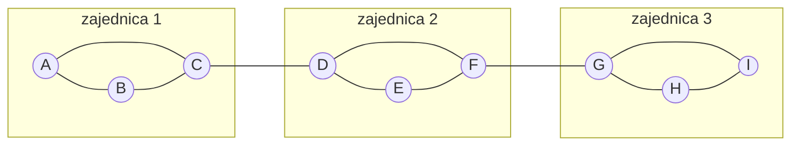
*Tri gusto povezane grupe s rijetkim „mostovima" između njih. Detekcija zajednica traži upravo ovakve strukture.*

*Korak-po-korak primjena svih algoritama opisanih u ovom poglavlju nalazi se u [bilježnici](../code/06_detekcija_zajednica.ipynb).*

---

## Teorijski koncept

**Zajednica** (u mrežnom smislu) nije nužno ono što sudionici nazivaju „zajednica"; to je **strukturalna** grupa: skup čvorova s **više veza unutar skupa** nego prema ostalim čvorovima. Takve grupe često odgovaraju društvenim ili kulturnim segmentima — npr. grupe interesa na društvenim mrežama, odjeli u organizaciji, klike prijatelja.

Zašto je ovo važno? Zato što **struktura grupe** govori nešto o dinamici mreže:
- Unutar zajednice informacije se šire brzo (svi su blizu jedni drugima).
- Između zajednica informacije putuju sporije i često kroz posrednike (mostove).
- Pripadnost zajednici može oblikovati identitet, ponašanje i norme.

**Detekcija zajednica** omogućuje da ih identificiramo bez unaprijed zadanih kategorija: algoritam „traži" particiju koja maksimizira neku mjeru kohezije (npr. modularnost). Time možemo otkriti **latentnu strukturu** mreže — grupu koja postoji u podatcima, ali ju nitko nije unaprijed definirao. Možemo usporediti tu latentnu strukturu s poznatim grupama (institucije, interesi, demografija) ili pratiti kako se zajednice mijenjaju u vremenu.

*Ilustracija — intuicija: zajednica = gustoća unutar > gustoća izvana.*

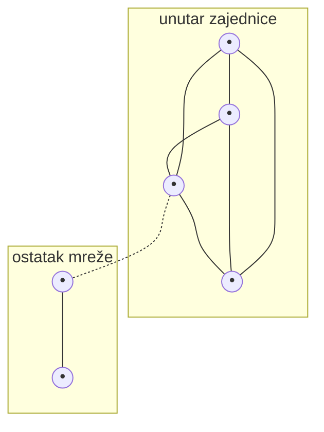
*Unutar zajednice: puno veza (pune linije). Prema van: rijetke veze (isprekidana linija). Algoritmi traže particiju koja maksimizira taj kontrast.*

---

## Definicije

Da bismo mogli precizno govoriti o zajednicama i algoritmima, evo osnovnog rječnika:

- **Zajednica (community)**: Skup čvorova takav da je **gustoća veza unutar skupa** veća (ili značajno veća) od gustoće veza prema ostalim čvorovima. Ne postoji jedna univerzalna definicija — različiti algoritmi koriste različite kriterije (modularnost, gustoća, protok informacija).

- **Particija**: Podjela svih čvorova mreže u nepreklapajuće grupe — svaki čvor pripada točno jednoj zajednici. Rezultat većine algoritama je upravo particija. (Postoje i metode koje dopuštaju **preklapajuće zajednice** — čvor može biti u više grupa.)

- **Modularnost (modularity, Q)**: Mjera kvalitete particije. Uspoređuje broj veza unutar grupa s **očekivanim** brojem u nasumičnoj mreži istih stupnjeva čvorova. Vrijednost Q:
  - **Q ≈ 0** → particija nije bolja od nasumične (nema jasne strukture zajednica).
  - **Q > 0.3** → obično se smatra da postoji značajna struktura zajednica.
  - **Q > 0.7** → vrlo izražene zajednice.
  - Maksimalna teoretska vrijednost je 1, ali u praksi rijetko prelazi 0.7.

- **Null model (nulti model)**: Referentna točka za modularnost — „što bismo očekivali u mreži bez strukture zajednica?". Najčešće: nasumična mreža koja čuva stupnjeve čvorova (configuration model). Modularnost mjeri upravo koliko stvarna mreža odstupa od tog nultog modela.

- **Algoritam Louvain**: Heuristički algoritam za **maksimizaciju modularnosti**. Brz je i često korišten; radi u dva koraka:
  1. **Lokalno premještanje**: svaki čvor se premješta u zajednicu susjeda koja daje najveći porast modularnosti.
  2. **Agregacija**: zajednice se komprimiraju u „superčvorove" i postupak se ponavlja.
  Daje jednu particiju; ponovljenim koracima moguće je dobiti hijerarhiju.

- **Algoritam Girvan–Newman**: Pristup „odozgo prema dolje" — umjesto traženja gustih grupa, **uklanja mostove**. Računa betweenness za sve bridove; brid s najvišim betweennessom se uklanja; postupak se ponavlja dok se mreža ne raspadne na komponente. Svaki korak daje drukčiju particiju; odabiremo onu s najvećom modularnošću.

- **Label propagation**: Svaki čvor počinje s jedinstvenom oznakom; u svakom koraku preuzima najčešću oznaku svojih susjeda. Postupak se ponavlja dok oznake ne konvergiraju. Brz i ne zahtijeva parametre, ali rezultat može varirati između pokretanja.

- **Spektralno klasteriranje (spectral clustering)**: Koristi eigenvektore Laplacijana grafa za projekciju čvorova u niskodimenzionalni prostor, a zatim primjenjuje standardno klasteriranje (npr. k-means). Zahtijeva unaprijed broj grupa.

- **Infomap**: Temelji se na teoriji informacija — traži particiju koja minimalizira duljinu opisa nasumičnog hoda po mreži. Posebno dobar za usmjerene mreže i detektiranje protoka.

- **Hijerarhijska detekcija zajednica**: Metode koje daju ne jednu particiju, nego **stablo** zajednica — od sitnih podgrupa do velikih klastera. Korisno kad mreža ima višerazinsku strukturu (npr. odjeli → sektori → organizacija).

- **Preklapajuće zajednice**: Situacija kad čvor pripada više zajednica istovremeno (npr. osoba koja je i u sportskom klubu i u kulturnoj udruzi). Metode poput COPRA ili BigCLAM to dopuštaju.

---

## Kako radi modularnost — intuitivno

Zamislimo mrežu razreda u školi. Ako podijelimo učenike po razredima:
- **Unutar razreda** — većina prijateljstava je ovdje (sjede zajedno, rade projekte, druže se na odmoru).
- **Između razreda** — manje prijateljstava (uglavnom iz izvanškolskih aktivnosti).

Modularnost mjeri upravo to: koliko su veze „koncentrirane" unutar grupa u usporedbi s onim što bismo očekivali da su prijateljstva nasumična. Ako su razredi stvarne zajednice, Q će biti visok. Ako bismo učenike podijelili nasumično u grupe, Q bi bio blizu nuli.

*Ilustracija — modularnost: dobra vs loša particija.*

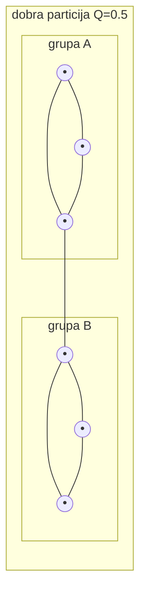
*Dobra particija: većina veza unutar grupa, malo između → visoka modularnost.*

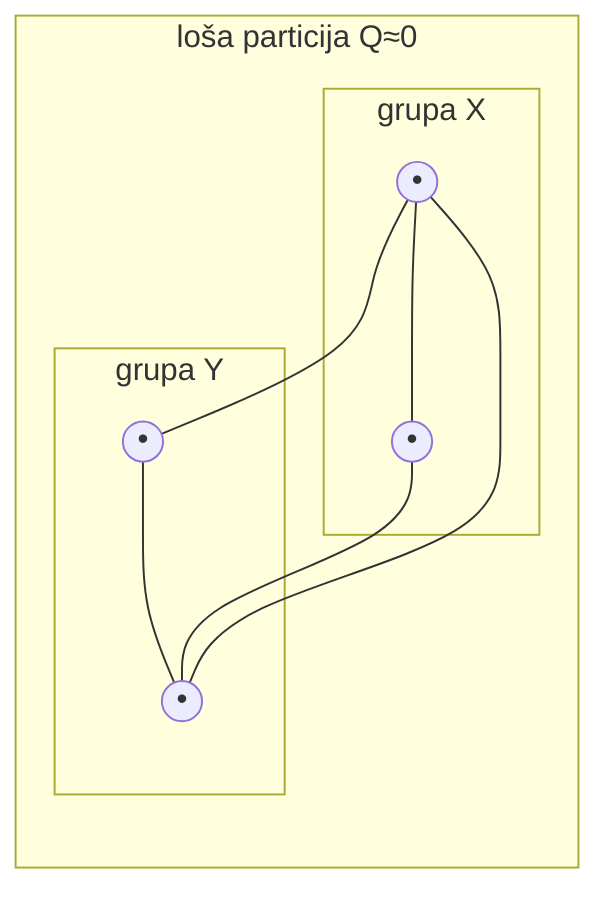
*Loša particija: jednako veza unutar i između grupa → niska modularnost.*

---

## Kako radi Louvain — korak po korak

Louvain je najčešće korišteni algoritam za detekciju zajednica. Evo kako radi na jednostavnom primjeru:

**Početak**: Svaki čvor je sam svoja zajednica.

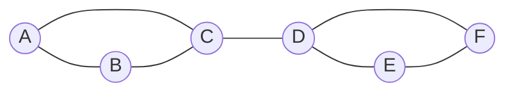
*Šest čvorova, svaki u svojoj „zajednici" (šest zajednica od jednog čvora).*

**Korak 1 — Lokalno premještanje**: Algoritam redom prolazi čvorove. Za svaki čvor provjerava: „Bi li modularnost porasla kad bih prešao u zajednicu nekog od mojih susjeda?" Ako da, premješta ga tamo gdje je porast najveći.
- A se pridružuje B i C → nastaje zajednica {A, B, C}.
- D se pridružuje E i F → nastaje zajednica {D, E, F}.
- Sada imamo dvije zajednice i jednu vezu (C–D) između njih.

**Korak 2 — Agregacija**: Svaka zajednica postaje jedan „superčvor". Veze između zajednica postaju veze između superčvorova. Na novom (manjem) grafu ponavlja se Korak 1.

**Rezultat**: Dvije zajednice: {A, B, C} i {D, E, F}. Modularnost je maksimalizirana.

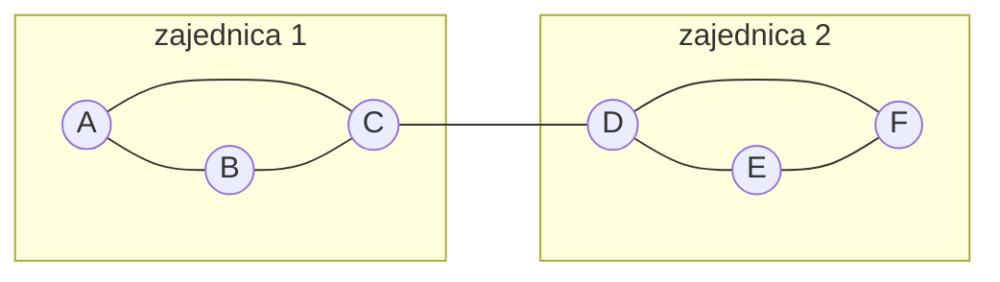
*Rezultat Louvainja: dva klastera s jednim mostom između njih.*

---

## Kako radi Girvan–Newman — korak po korak

Girvan–Newman radi obrnuto od Louvainja — umjesto „građenja" zajednica, **rastavlja** mrežu uklanjanjem mostova:

**Početak**: Cijela mreža, svi čvorovi u jednoj „zajednici".

**Korak 1**: Izračunaj betweenness centralnost za sve **bridove** (ne čvorove). Brid s najvišim betweennessom je „most" — leži na najviše najkraćih puteva.

**Korak 2**: Ukloni taj brid.

**Korak 3**: Provjeri modularnost trenutne particije (svaka povezana komponenta = zajednica).

**Ponavljaj** korake 1–3 dok ne dobiješ željeni broj zajednica ili dok modularnost ne počne padati.

*Ilustracija — Girvan–Newman na primjeru: brid C–D ima najviši betweenness jer svi putevi između lijeve i desne grupe prolaze kroz njega.*

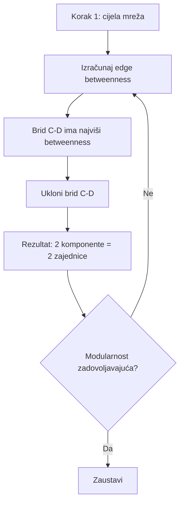
*Postupak se ponavlja dok ne dobijemo optimalnu particiju.*

**Prednost**: Konceptualno intuitivan — uklanjamo ono što razdvaja grupe.
**Nedostatak**: Spor za velike mreže (betweenness se mora preračunati nakon svakog uklanjanja).

---

## Usporedba algoritama

| Algoritam | Pristup | Brzina | Potreban parametar? | Najbolje za |
|-----------|---------|--------|---------------------|-------------|
| **Louvain** | Odozdo gore (spajanje) | Brz | Ne | Velike mreže, opća primjena |
| **Girvan–Newman** | Odozgo dolje (rastavljanje) | Spor | Ne (ali daje dendogram) | Male/srednje mreže, didaktika |
| **Label propagation** | Širenje oznaka | Vrlo brz | Ne | Velike mreže kad treba brzina |
| **Spektralno** | Eigenvektori Laplacijana | Srednje | Da (broj grupa k) | Kad znamo broj zajednica |
| **Infomap** | Teorija informacija | Brz | Ne | Usmjerene mreže, protok |

*Nema „najboljeg" algoritma — izbor ovisi o veličini mreže, tipu podataka i istraživačkom pitanju.*

---

## Ključni istraživači

- **Vincent Blondel, Jean-Loup Guillaume, Renaud Lambiotte i Etienne Lefebvre (2008)** u članku „Fast unfolding of communities in large networks" (*Journal of Statistical Mechanics*) opisuju Louvain algoritam koji je postao jedan od standardnih alata za detekciju zajednica.
- **Michelle Girvan i Mark Newman (2002)** u „Community structure in social and biological networks" (*PNAS*) uvode pristup temeljen na bridnom betweennessu — konceptualno elegantan i utjecajan u razvoju cijelog polja.
- **Mark Newman (2006)** formalizira modularnost kao optimizacijsku funkciju u „Modularity and community structure in networks" (*PNAS*).
- **Santo Fortunato (2010)** u preglednom članku „Community detection in graphs" (*Physics Reports*) daje opsežan pregled svih metoda i mjera — referenca za dublje razumijevanje.
- **Lei Tang i Huan Liu** (ur.) u knjizi *Community Detection and Mining in Social Media* daju pregled metoda detekcije zajednica u kontekstu društvenih medija i velikih grafova.
- **Borgatti, Everett i Johnson** u *Analyzing Social Networks* raspravljaju o interpretaciji grupa u SNA-u i o povezivanju strukturalnih klastera s društvenim kategorijama.

---

## Recentna literatura

- **Fortunato, S. (2010).** Community detection in graphs. *Physics Reports*. Opsežan pregled metoda i mjera.
- **Blondel et al. (2008).** Fast unfolding of communities (Louvain). *Journal of Statistical Mechanics*.
- **Girvan, M. & Newman, M. E. J. (2002).** Community structure in social and biological networks. *PNAS*.
- **Newman, M. E. J. (2006).** Modularity and community structure in networks. *PNAS*.
- **Traag, V. A., Waltman, L., & van Eck, N. J. (2019).** From Louvain to Leiden: guaranteeing well-connected communities. *Scientific Reports*. (Poboljšanje Louvainja — Leiden algoritam koji izbjegava loše povezane zajednice.)
- Korisno je tražiti radove od cca. 2015. nadalje o detekciji zajednica u **online mrežama** (skalabilnost, dinamičke mreže, usporedba algoritama).

---

## Problemi i izazovi

Korištenje detekcije zajednica nosi nekoliko izazova:

- **Odabir broja ili razine zajednica**: Neki algoritmi zahtijevaju unaprijed broj grupa (npr. spektralno klasteriranje); drugi (Louvain) ga ne. Hijerarhijski pristupi daju više razina; treba odlučiti koju razinu tumačiti. Nema univerzalnog pravila — korisno je usporediti rezultate za različite brojeve grupa i vidjeti koji „ima smisla" u kontekstu.

- **Stabilnost i reproducibilnost**: Različiti algoritmi ili različite randomizacije mogu dati različite particije. Louvain uključuje element slučajnosti (redoslijed čvorova); ponovljenim pokretanjem možemo dobiti malo drukčije grupe. Korisno je provjeriti koliko su rezultati stabilni (npr. ponoviti 10 puta i vidjeti podudaranje) i usporediti s kontekstom.

- **Rezolucijski limit**: Modularnost ima poznati problem — ne može detektirati zajednice manje od određene veličine u velikim mrežama. To znači da u mreži od 10 000 čvorova male zajednice (npr. 5 čvorova) mogu biti „nevidljive" za modularnošću vođene algoritme. Leiden algoritam djelomično rješava ovaj problem.

- **Interpretacija**: Pronađene grupe treba **interpretirati** — što ih čini kohezivnima? Odgovaraju li poznatim kategorijama (npr. institucije, interesi, geografija)? Bez interpretacije ostaje samo tehnički output. Ovo je možda najvažniji korak: algoritam daje particiju, ali **smisao** moramo dati mi.

- **Preklapajuće zajednice**: Većina algoritama daje nepreklapajuće grupe, ali u stvarnom životu ljudi pripadaju više grupa istovremeno. Ako je to relevantno za istraživačko pitanje, treba koristiti metode za preklapajuće zajednice.

- **Dinamičke zajednice**: Mreže se mijenjaju u vremenu — zajednice nastaju, rastu, spajaju se, raspadaju. Statička detekcija daje sliku u jednom trenutku; za praćenje evolucije potrebne su metode za dinamičke zajednice.

---

## Primjeri i interpretacija

### Primjeri iz stvarnog života (istraživanja)

- **Zacharyjev karate klub** — klasičan primjer u SNA-u: sociolog Wayne Zachary (1977) promatrao je mali karate klub na sveučilištu. Došlo je do sukoba između instruktora (Mr. Hi) i predsjednika kluba (Officer); klub se raspao na dva dijela. Kada na tu mrežu primijenimo Louvain, algoritam sam pronađe gotovo identičnu podjelu kao što se stvarno dogodila — bez ikakve informacije o sukobu, samo iz strukture veza.

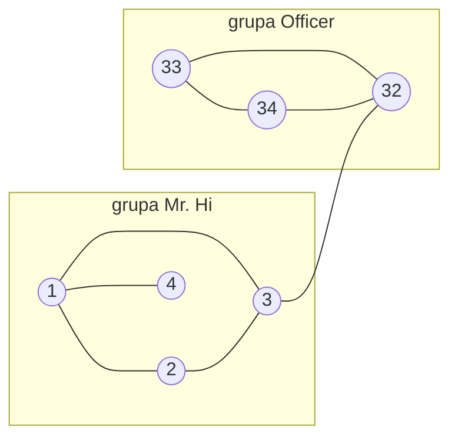
*Karate klub: algoritam detektira podjelu koja odgovara stvarnom raskolu. Ovo je „hello world" detekcije zajednica.*

- **Grupe interesa na društvenim mrežama**: Korisnici koji se međusobno više prate ili komentiraju često padaju u iste zajednice; mogu odgovarati tematskim skupinama (politika, sport, kultura), identitetskim skupinama (jezik, regija) ili ponašajnim klasterima (aktivni komentatori vs pasivni čitatelji).

- **Koautorske mreže**: Znanstvenici koji zajedno objavljuju radove tvore klastere po disciplinama ili istraživačkim temama. Detekcija zajednica na mreži koautorstva može otkriti „nevidljive škole" — grupe istraživača koji dijele pristup, ali se ne identificiraju formalno kao škola.

- **Klike u organizacijama**: Detekcija neformalnih grupa prema tome tko s kime surađuje ili komunicira (email, Slack, sastanci); usporedba s formalnom strukturom (odjeli, timovi) može otkriti stvarnu organizacijsku dinamiku vs onu na papiru.

---

### Primjeri iz filmova i serija

Zajednice su izuzetno intuitivne kada ih ilustriramo na mrežama likova iz filmova i serija — tko s kime razgovara, surađuje, sukobljava se.

- **Game of Thrones — kuće kao zajednice**:
  - Mreža likova iz serije ima jasne klastere: **Starki** (Winterfell — Ned, Catelyn, Robb, Arya, Sansa, Jon, Bran), **Lanisteri** (King's Landing — Cersei, Jaime, Tyrion, Tywin), **Targaryeni** (Essos → Westeros — Daenerys, Jorah, Missandei, Grey Worm), **Noćna straža** (Jon, Sam, Aemon, Tormund).
  - Unutar svake kuće likovi su gusto povezani — stalno razgovaraju, surađuju, svađaju se. Između kuća veze su rjeđe i često prolaze kroz **mostove**: Tyrion (koji putuje iz Lannisterove u Targaryensku orbitu), Sansa (koja se seli iz Starkove u Lannisterovu sferu).
  - Algoritam detekcije zajednica na ovoj mreži bi pronašao grupe koje gotovo savršeno odgovaraju kućama — bez ikakve informacije o prezimenu ili geografiji.

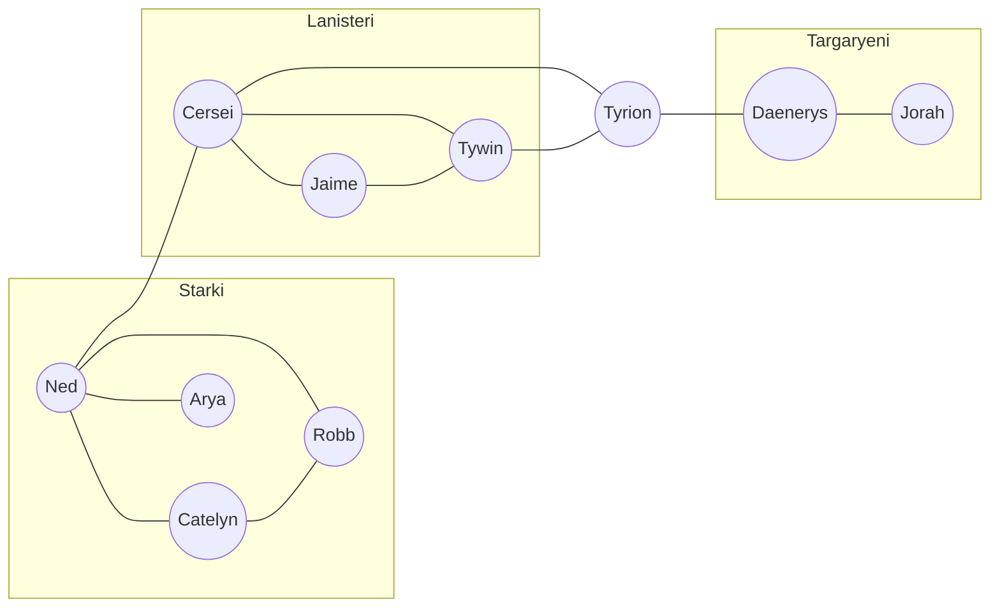
*Kuće = zajednice. Tyrion = most koji prelazi iz jedne zajednice u drugu. Modularnost ove podjele bi bila visoka.*

- **Marvel Cinematic Universe — timovi**:
  - **Avengers** (Iron Man, Captain America, Thor, Hulk, Black Widow, Hawkeye) — gusto povezani kroz zajedničke bitke i filmove.
  - **Guardians of the Galaxy** (Star-Lord, Gamora, Drax, Rocket, Groot) — odvojeni klaster s malo veza prema Avengersima.
  - **Wakanda** (Black Panther, Shuri, Okoye, M'Baku) — treći klaster.
  - Čvorovi poput **Thora** (koji se pojavljuje i s Avengersima i s Guardiansima) ili **Thanosa** (koji ugrožava sve) su **bridging čvorovi** — povezuju zajednice.
  - Na MCU mreži algoritam bi detektirao: Avengers, Guardians, Wakanda, Spider-Man krug, Doctor Strange krug — vrlo slično način na koji gledatelji intuitivno grupiraju likove.

- **Harry Potter — kuće Hogwartsa**:
  - **Gryffindor** (Harry, Ron, Hermione, Neville, Ginny) — stalna komunikacija, zajednička soba, avanture.
  - **Slytherin** (Malfoy, Crabbe, Goyle, Snape) — manje interakcija s Gryffindorom, gusto povezani unutar.
  - **Profesori** (Dumbledore, McGonagall, Snape, Hagrid) čine posebnu zajednicu povezanu s obje kuće.
  - Snape je fascinantan čvor: pripada Slytherinu ali ima jake veze i s Dumbledoreom i s Harryjem — klasičan primjer čvora na granici dviju zajednica.

- **The Wire — institucije i ulica**:
  - Serija prikazuje više paralelnih svjetova: **ulične bande** (Avon, Stringer, Omar), **policija** (McNulty, Bunk, Freamon), **politika** (Carcetti, Clay Davis), **luka** (Frank Sobotka), **škola** (sezona 4).
  - Detekcija zajednica na mreži likova gotovo savršeno prati te institucionalne granice.
  - Most između „ulice" i „policije" je Omar ili informanti — čvorovi s visokim betweennessom koji leže između zajednica.

---

### Primjeri iz umjetnosti, književnosti i glazbe

- **Pariški književni krugovi 1920-ih**:
  - Na mreži „tko s kime druži" mogli bismo detektirati zajednice: **američki expatrioti** (Hemingway, Fitzgerald, Dos Passos), **francuska avangarda** (Breton, Éluard, Aragon — nadrealisti), **vizualni umjetnici** (Picasso, Matisse, Duchamp).
  - **Gertrude Stein** bi bila na granici između američkih pisaca i europskih umjetnika — most između zajednica.
  - Modularnost bi bila umjereno visoka jer su krugovi djelomično izolirani, ali Pariz kao „čvorište" ih spaja više nego bi bili u svojim matičnim zemljama.

- **Glazbeni žanrovi kao zajednice**:
  - Na mreži suradnji (tko s kime snima pjesme / albume) žanrovi tvore zajednice: **hip-hop** (Drake, Kendrick, J. Cole, 21 Savage), **pop** (Taylor Swift, Ed Sheeran, Ariana Grande), **country** (Morgan Wallen, Luke Combs).
  - **Crossover umjetnici** su mostovi: Lil Nas X (country + hip-hop), Post Malone (hip-hop + pop + rock), Beyoncé (pop + R&B + country).
  - Hip-hop crewovi (Odd Future, A$AP Mob, Griselda) su **podzajednice unutar zajednica** — hijerarhijska struktura koju možemo vidjeti na različitim razinama rezolucije.

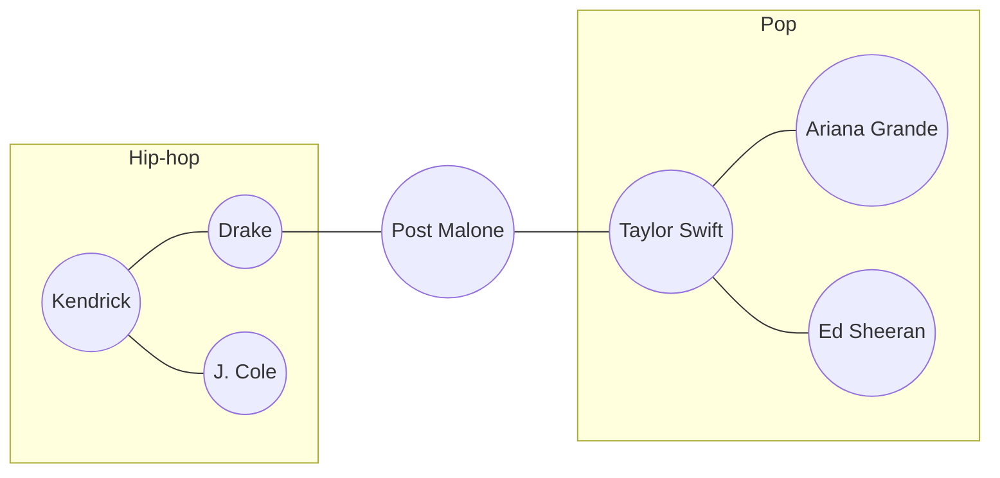
*Glazbeni žanrovi kao zajednice. Post Malone = most između hip-hopa i popa. Algoritam detekcije zajednica na Spotify suradnjama daje slične grupe.*

- **Umjetnički pokreti kao zajednice**:
  - **Impresionisti** (Monet, Renoir, Degas, Pissarro, Cézanne) — zajedničke izložbe, atelieri, debata. Gusta mreža unutar grupe.
  - **Bloomsbury Group** (Virginia Woolf, Keynes, E. M. Forster, Lytton Strachey) — pisci i intelektualci povezani prijateljstvima i intelektualnom razmjenom.
  - **Bauhaus** (Gropius, Kandinsky, Klee, Moholy-Nagy) — škola dizajna kao formalna zajednica koja se vidi i u mreži suradnji.
  - Između pokreta postojali su rijetki ali važni mostovi — npr. Duchamp koji povezuje dadaizam i nadrealizam; Picasso koji prolazi kroz više stilova i krugova.

- **Književne škole**:
  - Na mreži citiranja ili međusobnog utjecaja možemo detektirati zajednice: **ruski formalisti** (Šklovskij, Jakobson, Tinjanov), **strukturalisti** (Lévi-Strauss, Barthes, Todorov), **poststrukturalisti** (Derrida, Foucault, Deleuze).
  - Unutar škole autori se intenzivno citiraju i komentiraju; između škola manje. Modularnost bi bila visoka.
  - Jakobson je zanimljiv primjer mosta: formalist koji utječe na strukturaliste.

---

### Nedavni primjeri (online zajednice, streaming, gaming)

- **Twitter/X politički klasteri**: Istraživanja konzistentno pokazuju da mreže retvitanja na Twitteru imaju izrazitu bipartitnu strukturu — dva velika klastera koji odgovaraju politički lijevim i desnim korisnicima, s malo „mosta" između. Modularnost tih particija je obično 0.4–0.6 — vrlo izražena struktura zajednica koja je zapravo **echo chamber** (eho-komora).

- **Reddit subforumi**: Mreža subreddita (povezani ako isti korisnici aktivno sudjeluju u oba) ima jasne zajednice: gaming klasteri (r/gaming, r/pcgaming, r/Steam), politički klasteri, hobistički klasteri. Detekcija zajednica na toj mreži otkrila je neintuitivne veze — npr. subredditi o kućnim ljubimcima i mentalnom zdravlju su često u istoj zajednici jer ih isti korisnici posjećuju.

- **Twitch / YouTube collab mreže**: Streameri koji su često u „collab" jedni s drugima čine zajednice — npr. određeni gaming krug, beauty/fashion krug, krug kreatora edukativnog sadržaja. Algoritmi preporuke pojačavaju te klastere — platforma preporučuje slične kreatore, što pojačava gustoću veza unutar zajednice.

- **Discord serveri i gaming**: Igrač koji je aktivan na više Discord servera (npr. jedan za *League of Legends*, drugi za *Minecraft*, treći za lokalnu zajednicu) je most između zajednica. Većina igrača ostaje pretežno u jednom klasteru — algoritam ih lako detektira.

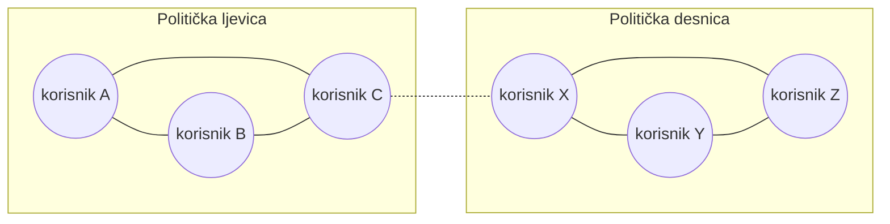
*Twitter retvit mreža: dva jasna klastera s rijetkim vezama između — echo chamber efekt. Isprekidana linija = rijetka međuklasterska veza.*

---

## Interpretacija rezultata — praktični savjeti

Kada dobijete rezultat detekcije zajednica, **ne zaustavljajte se na particiji**. Evo koraka za kvalitetnu interpretaciju:

1. **Vizualizirajte**: Obojite čvorove prema zajednici i pogledajte ima li smisla. Jesu li grupe prostorno odvojene? Postoje li jasni mostovi?

2. **Usporedite s poznatim kategorijama**: Ako imate metapodatke o čvorovima (institucija, spol, lokacija, interesi), provjerite koliko se algoritmom pronađene zajednice podudaraju s tim kategorijama. Podudaranje sugerira da struktura veza odražava te socijalne dimenzije.

3. **Pogledajte mostove**: Čvorovi koji leže na granici dviju zajednica (ili imaju jake veze i u svoju i u susjednu zajednicu) su posebno zanimljivi — to su posrednici, brokeri, kulturni prevodioci.

4. **Usporedite algoritme**: Pokrenite dva-tri algoritma i usporedite rezultate. Ako svi daju sličnu particiju, struktura je robusna. Ako se razlikuju, to sugerira da zajednice nisu jasno definirane ili da postoji višerazinska struktura.

5. **Pogledajte modularnost**: Q > 0.3 znači da zajednice „postoje" u podatcima. Q < 0.1 znači da mreža nema jasnu strukturu zajednica — možda je previše homogena ili previše nasumična.

6. **Ispitajte rubove**: Čvorovi s jednakom vezom prema svojoj i susjednoj zajednici su „granični" — možda zapravo pripadaju dvjema grupama ili su na „nikojezemstvu".

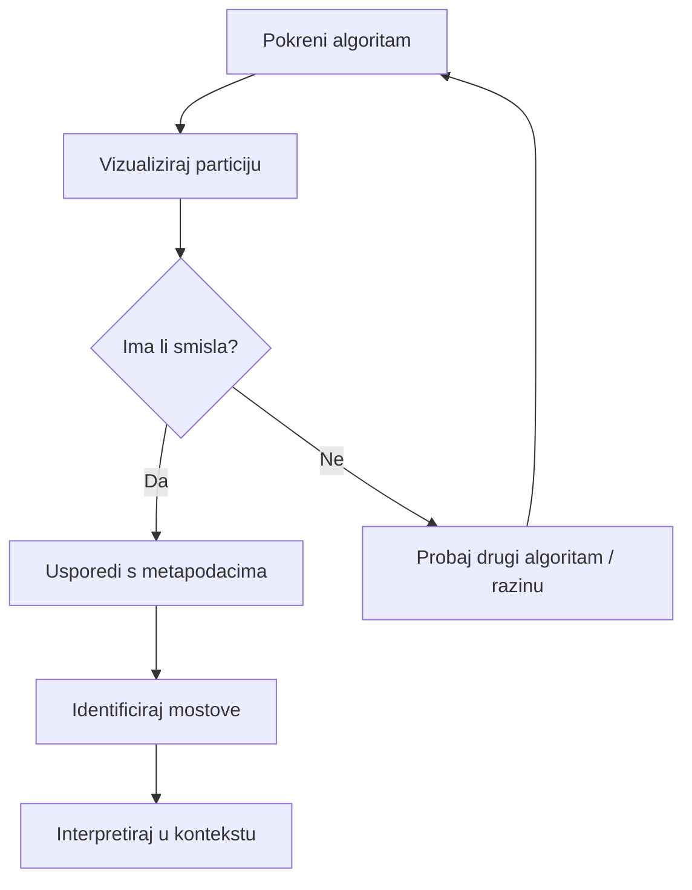
*Radni tok interpretacije: od algoritma do smislene priče.*

---

## Alati

- **NetworkX**: Ugrađena podrška za detekciju zajednica:
  - `nx.community.louvain_communities(G)` — Louvain algoritam (od verzije 2.7+).
  - `nx.community.greedy_modularity_communities(G)` — pohlepna maksimizacija modularnosti.
  - `nx.community.label_propagation_communities(G)` — label propagation.
  - `nx.community.girvan_newman(G)` — Girvan–Newman (vraća generator particija).
  - `nx.community.modularity(G, communities)` — izračun modularnosti za danu particiju.

- **python-louvain** paket: `community_louvain.best_partition(G)` — popularna implementacija Louvainja koja vraća rječnik {čvor: zajednica}.

- **igraph** (Python): Za veće mreže; ima implementacije Louvainja, Infomapa, label propagation i Leiden algoritma. Značajno brži od NetworkX-a za mreže s > 10 000 čvorova.

- **Gephi**: Modul za Modularity; pokreće se algoritam i dobiva se particija te vizualizacija po boji zajednica. Odličan za eksploratorno istraživanje i prezentaciju rezultata.

- **cdlib** (Python): Specijalizirana biblioteka za detekciju zajednica s implementacijama 50+ algoritama, uključujući metode za preklapajuće zajednice. Korisna za istraživanje i usporedbu.

U bilježnici uz ovo poglavlje (`06_detekcija_zajednica.ipynb`) dan je primjer na Zacharyjevom karate klubu; za velike mreže preporučuje se igraph ili cdlib.

---

## Veze s drugim poglavljima

- **Poglavlje 3 (Mjere mrežne strukture)**: Modularnost je jedna od mjera klasteriranja; betweenness centralnost (pogl. 3) koristi se u Girvan–Newman algoritmu za identifikaciju mostova između zajednica.
- **Poglavlje 4 (Socijalni kapital)**: Zajednice u mreži odgovaraju konceptu bonding kapitala (veze unutar grupe); mostovi između zajednica su bridging kapital (veze između grupa).
- **Poglavlje 5 (Usmjerene i težinske mreže)**: Algoritmi se mogu prilagoditi za težinske mreže (veze imaju intenzitet) i usmjerene mreže (protok informacija).
- **Poglavlje 7 (Vizualizacija)**: Vizualizacija zajednica (boja = zajednica) jedan je od najsnažnijih načina prikaza mrežne strukture.
- **Poglavlje 8 (Difuzija)**: Zajednice utječu na širenje informacija — unutar zajednice širi se brzo, između sporije.

---

Vidi primjer: [06_detekcija_zajednica.ipynb](../code/06_detekcija_zajednica.ipynb)

---

**Povezivanje sadržaj ↔ kod**

| Što tražite | Gdje |
|-------------|------|
| Definicije (zajednica, modularnost, algoritmi) | Ovaj dokument, odlomak **Definicije** |
| Intuicija za modularnost | Ovaj dokument, **Kako radi modularnost — intuitivno** |
| Louvain korak po korak | Ovaj dokument, **Kako radi Louvain** |
| Girvan–Newman korak po korak | Ovaj dokument, **Kako radi Girvan–Newman** |
| Usporedba algoritama | Ovaj dokument, **Usporedba algoritama** |
| Konceptualni primjeri (filmovi, serije, umjetnosti, online) | Ovaj dokument, **Primjeri i interpretacija** |
| Korak-po-korak izračun u Pythonu (NetworkX) | [06_detekcija_zajednica.ipynb](../code/06_detekcija_zajednica.ipynb) |
| Savjeti za interpretaciju | Ovaj dokument, **Interpretacija rezultata** |
