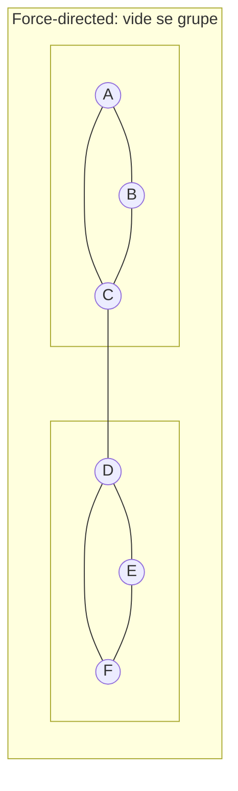
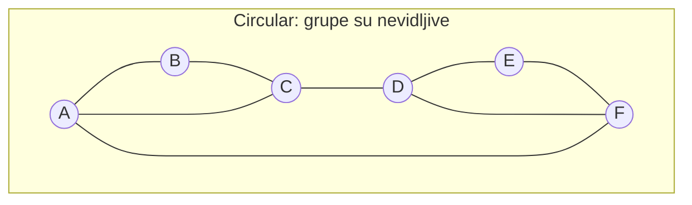
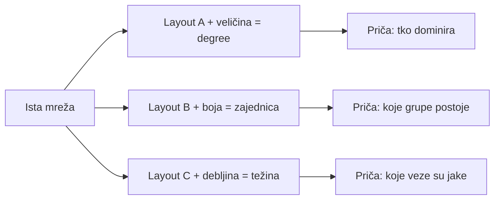
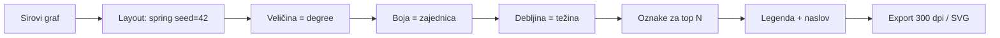
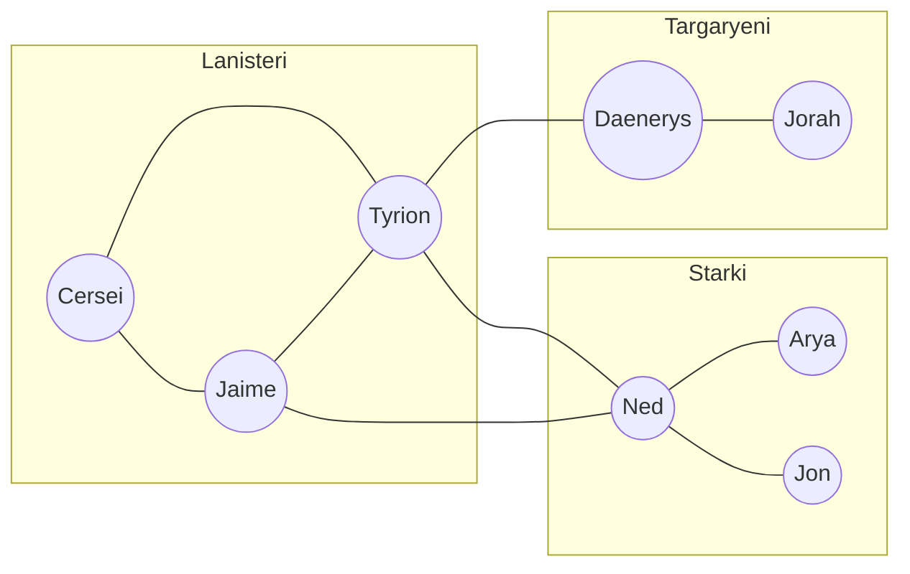
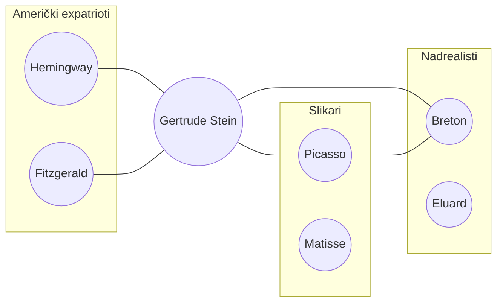
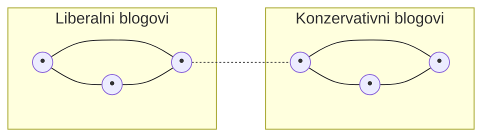

# 7. Vizualizacija društvenih mreža i njihovih svojstava

Brojke i tablice opisuju mrežu, ali **vizualizacija** često omogućuje da **vidimo** strukturu: tko je u sredini, gdje su grupe, koji čvorovi povezuju različite dijelove. Dobra vizualizacija služi istraživaču za pregled i provjeru, a publici za **komunikaciju** rezultata. No vizualizacija nije neutralna: odabir **layouta** (kako pozicionirati čvorove), **boja**, **veličine** i **debljine bridova** utječe na to što naglašavamo i kako se graf čita. Kao kulturalnog studenta, ovo poglavlje vas uči kako na slici mreže istodobno **kodirati podatke** (struktura, uloge, zajednice) i **retorički uokviriti poruku** — i zašto je svaka vizualizacija već **interpretacija**.

**Ilustracija:** Ista mreža, dva layouta — ista podatkovna istina, drukčija priča. U force-directed layoutu vidimo dvije kohezivne grupe; u kružnom (circular) layoutu grupa više nije očita.




*Isti podaci, dva layouta, dvije priče. Layout je dio interpretacije.*

*Korak-po-korak izrada svih ovih prikaza u Pythonu (NetworkX + matplotlib) nalazi se u [bilježnici](../code/07_vizualizacija_layouti.ipynb).*

---

## Teorijski koncept

Vizualizacija mreža nije samo „ljepša tablica” — to je poseban **medij prikaza** s vlastitim konvencijama. Ima nekoliko ciljeva:

- **(1) Pregled (eksploracija)** — brzo uočiti opću strukturu, outlier čvorove, očite klastere prije bilo kakvog računanja. Često nam slika **pokaže** ono što kasnije mjere potvrde brojevima.
- **(2) Provjera (verifikacija)** — je li particija u zajednice (pogl. 6) smislena, ima li artefakata u podacima (izolirani podgrafovi, duplicirani čvorovi), gdje su najveći stupnjevi (pogl. 3).
- **(3) Komunikacija** — predstaviti rezultate drugima (čitateljima, studentima, sudionicima istraživanja, medijima). Dobar prikaz može zamijeniti tri odlomka teksta.
- **(4) Retorika i argument** — vizualizacija je već **teza**: onim što biramo naglasiti (layout, boja, veličina) uvjeravamo čitatelja u određeno tumačenje.

Da bi vizualizacija bila informativna, **layout** (pozicija čvorova) i **atributi** (veličina, boja, debljina bridova, oblik) moraju prenositi **informaciju**, a ne biti samo dekoracija. Force-directed layouti („spring”) grupirat će gusto povezane čvorove (pa se vide zajednice); veličina čvora može odgovarati centralnosti (pa odmah vidimo „tko je važan”); boja — pripadnosti zajednici ili kategoriji; debljina brida — težini veze (pogl. 5). Loše odabrane opcije mogu dovesti do **vizualne zbrke** („hairball”) ili, još gore, **pristrane slike** koja sugerira nešto čega u podatcima nema.

Za kulturalne studije to znači sljedeće: svaka mrežna vizualizacija koju vidimo u novinama, znanstvenom članku ili infografici treba se čitati kao **tekst** — tko ju je napravio, koje je odluke donio (tko je u centru? koje su boje?), koja je publika, i kakve efekte takve odluke proizvode. Isti skup podataka može podržati vrlo različite priče.

*Ilustracija — ista mreža, tri različite priče kroz odluke vizualizacije.*


*Vizualizacija = odluka + podaci. Svaka grana vodi do drukčijeg tumačenja.*

---

## Definicije

Da bismo mogli razgovarati o konkretnim tehnikama, evo osnovnog rječnika.

- **Layout (raspored)**: Algoritam koji **pozicionira čvorove** u 2D (ili 3D) prostoru tako da graf postane čitljiv. Layout ne mijenja podatke — mijenja samo **gdje** se čvorovi crtaju. Postoje stotine layout algoritama; u praksi koristimo tri-četiri najčešća.

- **Force-directed layout (spring)**: Simulira fizičku analogiju — bridovi su „opruge” (privlače povezane čvorove), a čvorovi se međusobno „odbijaju” kao nabijeni magneti. Sustav se iterativno umiri dok ne pronađe stanje minimalne energije. Rezultat: **gusto povezane grupe se stisnu zajedno**, rjeđe povezani čvorovi ostaju na rubu. Ovo je default izbor za većinu socijalnih mreža. U NetworkX-u: `nx.spring_layout(G)`. Varijanta **Fruchterman–Reingold** (1991) najpoznatija je implementacija, **Kamada–Kawai** (1989) druga česta.

- **Circular layout**: Sve čvorove raspoređuje po **krugu**, ravnomjerno. Vrlo jednostavan i uredan — dobar kad želimo **svakog čvora tretirati jednako** ili kad je broj čvorova mali. Rijetko otkriva strukturu zajednica; dobar za prikaz **ciklusa** ili za estetski „chord diagram” stil. `nx.circular_layout(G)`.

- **Shell layout**: Čvorove smjestiti u **koncentrične krugove** prema nekom kriteriju (npr. vanjski krug = periferija, unutarnji = jezgra). Koristan kad postoji jasna hijerarhija ili k-core struktura. `nx.shell_layout(G)`.

- **Hierarchical (tree / Sugiyama) layout**: Čvorove raspoređuje u **slojeve** prema razini — korisno za stabla, organizacijske mreže, genealogije, tokove ovisnosti. Nije ugrađen u NetworkX direktno (koristi se Graphviz preko `nx.nx_agraph.graphviz_layout`), ali je standard za DAG-ove i taksonomije.

- **Bipartite / multipartite layout**: Za dvodijelne ili više-slojne mreže (npr. korisnici ↔ sadržaji, glumci ↔ filmovi) — svaki sloj na svojoj liniji. `nx.bipartite_layout(G, nodes_top)`.

- **Spektralni layout**: Koristi eigenvektore Laplacijana grafa za projekciju čvorova u 2D. Slično spektralnom klasteriranju (pogl. 6). `nx.spectral_layout(G)`.

- **Geografski layout**: Ako čvorovi imaju stvarnu lokaciju (npr. gradovi, zemlje, četvrti), pozicioniraju se prema geografskim koordinatama. Standard za prostorne mreže (migracije, transport, komunikacija između regija).

- **Atributi vizualizacije (vizualne varijable)**: Način na koji **prenosimo podatke u vizualne kodove**. U Jacques Bertinovoj tradiciji (*Semiology of Graphics*, 1967) osnovne su: **pozicija**, **veličina**, **oblik**, **boja (ton)**, **svjetlina**, **tekstura**, **orijentacija**. Za mreže najčešće koristimo:
  - **Veličina čvora** → stupanj ili neka mjera centralnosti (pogl. 3).
  - **Boja čvora** → pripadnost zajednici (pogl. 6) ili kategorija (spol, institucija, žanr).
  - **Oblik čvora** → tip entiteta (npr. korisnik vs hashtag, osoba vs institucija).
  - **Debljina brida** → težina (pogl. 5) ili broj interakcija.
  - **Boja brida** → tip veze (prijateljstvo, neprijateljstvo, ljubav).
  - **Smjer strelice** → usmjerenost veze (pogl. 5).

- **Label (oznaka, natpis)**: Tekstualna oznaka uz čvor (ime, ID). Korisna za male mreže; u velikim se prikazuje samo za najvažnije čvorove jer inače stvara vizualni šum.

- **Vizualna varijabla vs podatkovna varijabla**: Ključna distinkcija — koju **podatkovnu** kvalitetu kodiramo u koju **vizualnu** kvalitetu? Dobra vizualizacija to radi konzistentno i logično (npr. kvantitetu kodirati veličinom, kategoriju bojom). Loša miješa kodove.

- **Legenda i naslov**: Nisu opcionalni — bez njih čitatelj ne zna što „veliko plavo” znači. Uz svaku publikacijsku vizualizaciju treba: naslov, legenda za svaku vizualnu varijablu, izvor podataka, i ime layout algoritma (za reproducibilnost).

---

## Koji layout kada? — praktični vodič

Nema univerzalno „najboljeg” layouta; izbor ovisi o mreži i pitanju. Evo brze orijentacije:

| Situacija / podatak | Preporučeni layout | Zašto |
|---------------------|--------------------|----|
| Opća socijalna mreža (prijateljstva, razgovori) | Force-directed (spring) | Pokazuje zajednice, centar i periferiju |
| Male mreže (< 30 čvorova), žele se ravnopravno prikazati | Circular | Urednost, čitljivost, estetika |
| Hijerarhijski podaci (citati, organigram, roditelji–djeca) | Tree / Sugiyama | Slojevi odražavaju hijerarhiju |
| Mreža s jasnom jezgrom i periferijom | Shell / concentric | Razine se vizualno razdvajaju |
| Dvije vrste entiteta (korisnik–sadržaj, glumac–film) | Bipartite | Svaki tip u svom sloju |
| Podaci imaju koordinate (gradovi, zemlje) | Geografski | Prostorni odnosi su bitni |
| Jako velika mreža (> 2000 čvorova) | Force-directed + filtriranje + agregacija | Sirovi hairball je nečitljiv |
| Naglasiti ciklus / tok vremena | Circular s redoslijedom ili radial | Vrijeme kao kut |

*Ako ne znate odakle početi: pokušajte prvo spring layout. Ako je rezultat „hairball” (klupko), filtrirajte na top-N čvorova po stupnju ili agregirajte zajednice.*

---

## Vizualne varijable — kako kodirati podatke

Evo pet najčešćih kombinacija koje pokrivaju 90% praktičnih potreba:

**1. Veličina = degree (ili betweenness)** → odmah vidimo tko je „važan”.

```mermaid
graph LR
    A((A))
    B((((B))))
    C((C))
    D((D))
    E((E))
    B --- A
    B --- C
    B --- D
    B --- E
    A --- C
```
*B je očito hub (veliki čvor, visok stupanj). A, C, D, E su periferija.*

**2. Boja = zajednica (Louvain / ručno)** → odmah vidimo grupe.

**3. Debljina brida = težina (broj poruka, intenzitet)** → vide se jake vs slabe veze.

**4. Oblik čvora = tip entiteta** → razlikujemo osobe, institucije, hashtagove.

**5. Nijansa / transparencija = vrijeme ili novost** → stariji čvorovi blijedi, noviji jasni.

*Pravilo: ne koristite više od 3 vizualne varijable istovremeno. Čitatelj se ne može fokusirati na 5 dimenzija odjednom.*

---

## Korak po korak: od podataka do publikacijske vizualizacije

Recimo da imate mrežu razgovora u razredu (čvor = učenik, brid = „razgovarali smo barem 5 puta u tjednu”). Evo standardnog postupka:

**Korak 1 — Sirovi prikaz**: `nx.draw(G)` bez ikakvih opcija. Vjerojatno izgleda kao klupko. **Cilj**: provjeriti da graf uopće postoji i približno koliko ima čvorova.

**Korak 2 — Odabrati layout**: `spring_layout(G, seed=42)`. `seed` je važan — bez njega svaki put dobijete drukčiji raspored (force-directed algoritmi počinju s nasumičnim pozicijama) i rezultat **nije reproducibilan**.

**Korak 3 — Kodirati veličinu**: `node_size = [deg * 30 for deg in degrees]`. Sada vidimo tko je centralan.

**Korak 4 — Kodirati boju**: pokrenuti Louvain (pogl. 6), dodijeliti svakoj zajednici boju. Sada vidimo grupe.

**Korak 5 — Kodirati debljinu bridova**: `width = [w * 0.5 for w in weights]`. Vide se jake veze.

**Korak 6 — Oznake samo za najvažnije**: label-ovati samo top 5 čvorova po degree-u, da se izbjegne vizualni šum.

**Korak 7 — Legenda, naslov, izvor podataka**: uvijek.

**Korak 8 — Export u visokoj rezoluciji**: `plt.savefig('slika.png', dpi=300, bbox_inches='tight')`. Za znanstveni rad poželjan je SVG ili PDF (vektorski formati).


*Standardni workflow. Svaki korak dodaje jednu dimenziju informacije.*

Sve ove korake prolazi [bilježnica uz poglavlje](../code/07_vizualizacija_layouti.ipynb) na konkretnom primjeru (Zachary karate klub i mala mreža razgovora).

---

## Ključni istraživači i resursi

- **Jacques Bertin** u *Semiology of Graphics* (1967) postavlja teorijsku osnovu vizualizacije: **vizualne varijable** i što svaka od njih može izraziti. Temelj svih modernih priručnika.
- **Edward Tufte** u *The Visual Display of Quantitative Information* i kasnijim knjigama postavlja načela **jasnoće, poštenja prema podacima i izbjegavanja „chartjunka”** — korisno i za mrežne vizualizacije (manje dekoracije, više podataka po cm²).
- **Tamara Munzner** u *Visualization Analysis and Design* (2014) daje sustavan pregled načela: kada koji prikaz, kako izbjeći zloupotrebu, kako evaluirati vizualizacije. Suvremen referentni priručnik.
- **Peter Eades** („A heuristic for graph drawing”, 1984) i **Thomas Fruchterman & Edward Reingold** (1991) autori su prvih force-directed layout algoritama koji se i danas koriste.
- **Tomihisa Kamada i Satoru Kawai** (1989) dali su alternativni energetski model (Kamada–Kawai) koji često daje ljepše rezultate za manje mreže.
- **Kozo Sugiyama** (1981) je razvio standardni algoritam za hijerarhijske layoute (za DAG-ove).
- **Mike Bostock** (D3.js) i **Jeffrey Heer** (Vega, Vega-Lite, Prefuse) utjecajni su u području **interaktivne** vizualizacije na webu; D3.js je de facto standard za mrežne prikaze u novinskim medijima (NYT, Financial Times).
- **Manuel Lima** u *Visual Complexity: Mapping Patterns of Information* (2011) daje pregled estetike i povijesti mrežnih prikaza — korisno za kulturalno-kritičku perspektivu.

---

## Recentna literatura

- **Majeed, S., Uzair, M., Qamar, U. & Farooq, A. (2020).** Social Network Analysis Visualization Tools: A Comparative Review. *IEEE Access*. Usporedba Gephi, Cytoscape, NodeXL, Pajek i drugih.
- **Gibson, H., Faith, J., & Vickers, P. (2013).** A survey of two-dimensional graph layout techniques for information visualisation. *Information Visualization*.
- **McGee, F. et al. (2019).** The state of the art in multilayer network visualization. *Computer Graphics Forum*. Za složenije (multipleks) mreže.
- **Lima, M.** *The Book of Trees* i *Visual Complexity* — pregled povijesnih i suvremenih mrežnih vizualizacija.
- Dokumentacija i tutoriali za **Gephi** (gephi.org), **Cytoscape** (cytoscape.org), **Graphviz** (graphviz.org), **pyvis**, **NetworkX** i **igraph** ažuriraju se; korisno je uvijek provjeriti najnoviju verziju za primjere.

---

## Problemi i kritička perspektiva

Vizualizacija mreža je moćna, ali ima ozbiljnih ograničenja — posebno važnih za kulturalne studije:

- **Vizualna zbrka („hairball”)**: Na **velikim mrežama** (tisuće čvorova) čak i dobri layouti postaju nečitljivi — preklapanje čvorova i bridova, sve izgleda kao klupko. Rješenja: (a) **filtriranje** (prikazati samo top-N čvorova, ili samo giant component, ili samo bridove s težinom iznad praga), (b) **interaktivnost** (zum, pomicanje, highlight on hover), (c) **agregacija** (prikazati zajednice kao super-čvorove), (d) **multiple small multiples** (više manjih prikaza po dimenziji).

- **Pristranost layouta**: Odabir layouta može **sugerirati** strukturu koje nema. Force-directed layout uvijek „pronađe” neke grupe čak i u nasumičnoj mreži, jednostavno zato što fizička simulacija mora čvorove negdje smjestiti. Čitatelj vidi grupe i zaključuje da postoje. Uvijek treba provjeriti brojčano (modularnost, pogl. 6) postoji li stvarna struktura zajednica.

- **Ne-determinističke pozicije**: Bez `seed`-a, isti algoritam na istim podacima daje drukčiju sliku svaki put. To je problem za reproducibilnost i za komunikaciju (dvije slike istog istraživanja mogu izgledati potpuno drukčije). Uvijek fiksirajte `seed`.

- **Retorička moć boje**: Crveno/plavo za „lijevo/desno”, crveno za „opasno”, zeleno za „pozitivno” — kulturni kodovi utječu na interpretaciju. Izbor boja nije neutralan; treba ga opravdati ili koristiti neutralne palete (npr. ColorBrewer). Paziti i na daltoniste (8% muškaraca).

- **Etika i deanonimizacija**: Pri prikazu stvarnih mreža (npr. korisnici platformi, ispitanici u anketi) **ne otkrivajte identitete**. Labeliranje stvarnim imenima, prikazivanje sitnih podmreža koje otkrivaju pojedince, ili čak veličina čvora mogu implicirati identitet. GDPR i akademske etičke komisije ovo uzimaju ozbiljno — pseudonimizacija (ID-brojevi umjesto imena) ili prikaz samo agregiranih struktura (zajednica kao super-čvor) ponekad su **nužni**. Ovu temu detaljnije obrađuje poglavlje [13. Kritičko razmišljanje i ograničenja](./13_kriticko_razmisljanje_ogranicenja.md).

- **Vizualizacija kao argument**: Mreža „proteklih medija i moći” objavljena u tabloidu i mreža iste teme objavljena u znanstvenom časopisu izgledat će **drukčije** i **uvjeravati** u drukčije zaključke. Kulturalni studenti trebaju čitati svaku mrežnu sliku kao **argument**, ne kao neutralni prikaz.

- **„Nema legende = nema podataka”**: Vizualizacija bez legende, izvora i metodološke napomene je **propaganda**, ne analiza. To vrijedi i za znanstvene i za popularne prikaze.

---

## Primjeri iz kulture — kako vizualizacija mijenja priču

Kulturalnim studentima koncept postaje jasan kroz konkretne kulturne proizvode i primjere. Evo nekoliko.

### Filmovi i serije — mreže likova

Mreže likova (character networks) postale su popularan način analize narativa: tko s kim razgovara (ili ubija, voli, izdaje) u nekom filmu/seriji/knjizi. Svaki izbor vizualizacije priča drugu priču.

- **Game of Thrones — Andrew Beveridge & Jie Shan (2016)**: analizirali su mrežu likova iz knjiga *A Song of Ice and Fire*; brid između dva lika postavljen kad se spominju u razmaku od 15 riječi. Vizualizacija force-directed layoutom jasno je **izdvojila kuće** (Starki, Lanisteri, Targaryeni) kao zajednice. Veličina čvora = PageRank. Rezultat: Tyrion Lannister je u knjizi 5 najvažniji lik (ne Jon Snow, ne Daenerys) — **vizualizacija je otkrila nešto što obožavatelji nisu intuitivno znali**. Slobodno dostupno: [Network of Thrones — Math Horizons članak (PDF)](https://networkofthrones.wordpress.com/), [interaktivni dataset (Kaggle)](https://www.kaggle.com/datasets/mmmarchetti/game-of-thrones-dataset) — možete ga sami učitati u NetworkX u 5 linija koda.

- **Isto kod drugog layouta**: da su koristili circular layout, kuće se ne bi vidjele, i Tyrionova centralnost bila bi jedva primjetna. **Ista mreža, drukčiji zaključak** — zbog odluke o layoutu.


*Force-directed layout jasno pokazuje kuće. Tyrion je „mostovni” čvor — ima veze u sve tri grupe. To se **vidi** tek kad je layout dobar.*

- **Star Wars — saga kao mreža**: [Evelina Gabasova (2015)](https://evelinag.com/blog/2015/12-15-star-wars-social-network/) analizirala je dijalog mreže kroz sve filmove. Vizualizacija s force-directed layoutom pokazuje kako se likovi klasteriraju po trilogiji (prequel / original / sequel) — s R2-D2 i C-3PO kao mostovima kroz sve filmove. Da su čvorovi raspoređeni kronološki (hijerarhijski), priča bi bila „razvoj likova kroz vrijeme”; u spring layoutu priča je „tko s kim priča”. [Podaci na GitHubu](https://github.com/evelinag/StarWars-social-network).

- **The Wire — institucije**: serija David Simona o Baltimoreu idealan je primjer mreže u kojoj zajednice odgovaraju **institucijama** (ulica, policija, politika, škola, novine). Kada se vizualizira force-directed, vide se odvojeni klasteri — a **mostovi** (Omar, Bubbles, informanti) su upravo oni likovi koji seriji daju dinamiku. Vizualizacija **materijalizira** socijalnu teoriju Simona o „odvojenim svjetovima” (the game).

- **Harry Potter — kuće Hogwartsa**: mreža razgovora likova. Boja = kuća (Gryffindor crveno, Slytherin zeleno, itd.) jasno pokazuje koliko se kuće segregiraju. Snape je zanimljiv slučaj: po boji Slytherin, po poziciji (force-directed) blizu Gryffindora — **vizualizacija čini vidljivim njegovu dvostruku ulogu**.

### Knjige i mitologija

- **Mythological network analysis — [Mac Carron & Kenna (2012)](https://doi.org/10.1209/0295-5075/99/28002)**: analizirali mrežu likova iz *Beowulf*, *Táin Bó Cúailnge* (irski ep), *Ilijade*. Vizualizirali force-directed layoutom i pokazali da neke epove (npr. *Ilijada*) strukturom mreže prolaze iste testove realnosti kao stvarne društvene mreže, dok drugi (npr. *Beowulf*) imaju „nerealističnu” strukturu. **Vizualizacija je postala dokaz za pitanje: je li ovaj ep bio zasnovan na stvarnim ljudima?** (open access preprint: [arXiv:1205.4324](https://arxiv.org/abs/1205.4324))

- **Russian novels — Moretti's „distant reading”**: Franco Moretti u *Graphs, Maps, Trees* (2005) i eseju [„Network Theory, Plot Analysis” (New Left Review, 2011)](https://newleftreview.org/issues/ii68/articles/franco-moretti-network-theory-plot-analysis) koristi mrežne vizualizacije za *Hamleta* i druge drame — vizualizira tko s kim razgovara i pokazuje kako je Hamletov lik **strukturalno poseban** (veže puno podgrupa koje se inače ne doticu). Različiti layouti bi ovaj argument učinili snažnijim ili slabijim. Stanford Literary Lab ([litlab.stanford.edu](https://litlab.stanford.edu/)) objavljuje pamflete s ovakvim analizama otvorenog pristupa.

### Glazba

- **Spotify collaboration networks**: mreže „featuring”-a (tko je gostovao na čijoj pjesmi). Vizualizirano force-directed layoutom + Louvain za boje, jasno se vide **žanrovski klasteri** (hip-hop, pop, country, latin, K-pop), s crossover umjetnicima (Post Malone, Beyoncé, Bad Bunny) kao mostovima. Ako se ista mreža vizualizira geografski (prema zemlji porijekla izvođača), priča se mijenja — globalni hip-hop i latin pokazuju drukčije obrasce.

- **Klasična glazba — učitelj/učenik mreže**: tko je bio čiji učitelj kroz stoljeća. Vizualizirano **hijerarhijski** (vrijeme kao vertikalna os), vidi se Haydn → Beethoven → Czerny → Liszt kao genealoška linija. Vizualizirano **force-directed**, vidimo škole/pokrete (bečka klasika, romantizam, Nova bečka škola). **Dva layouta = dvije povijesti glazbe.**

### Umjetnost i književni krugovi

- **Pariški avangardni krugovi 1920-ih**: mreža susreta, pisama, suradnji između Hemingwaya, Steina, Picassa, Bretona, Joyca, Fitzgeralda. Force-directed jasno pokazuje Gertrude Stein kao **mostovni čvor** (Amerikanci ↔ Europljani, pisci ↔ slikari). Ako se vizualizira kronologijom (vrijeme), dobija se *narativ* razvoja modernizma; ako se vizualizira force-directed, dobija se *sociologija* krugova.

- **MoMA Inventing Abstraction (2012.)**: slavna izložba u MoMA-i koju je kustosica Leah Dickerman popratila velikom mrežnom vizualizacijom odnosa apstraktnih umjetnika ranog 20. stoljeća. Prikaz je bio ključan kustosko-retorički element izložbe: publika je vizualno „vidjela” da je apstrakcija rezultat **mreže**, ne genija pojedinaca. Odluka o boji (neutralna crno-bijela paleta) naglašavala je „objektivnost”, iako su odabir čvorova i veza već bili interpretacija. [MoMA arhiv izložbe](https://www.moma.org/interactives/exhibitions/2012/inventingabstraction/) ima interaktivnu verziju mreže.


*Stein kao strukturalni „brokеr” pariških avangardi — vidljivo tek u force-directed layoutu, nevidljivo u circular ili kronološkom.*

### Online i suvremeni mediji

- **Twitter/X politički grafovi**: [Adamic & Glance (2005) „The political blogosphere and the 2004 U.S. election”](https://dl.acm.org/doi/10.1145/1134271.1134277) — klasična vizualizacija mreže poveznica između političkih blogova ([PDF](http://www.ramb.ethz.ch/CDstore/www2005-ws/workshop/wf10/AdamicGlanceBlogWWW.pdf)). Force-directed + boja (crveno = konzervativni, plavo = liberalni) pokazala je **dva potpuno odvojena klastera** s minimalnim mostovima. Jedna od najcitiranijih slika u društvenim znanostima. Identična metodologija se danas koristi za Twitter/X retweet mreže — i gotovo uvijek potvrđuje **echo chamber** (eho-komoru). Usporedite s Pewovom analizom [„Mapping Twitter Topic Networks” (2014)](https://www.pewresearch.org/internet/2014/02/20/mapping-twitter-topic-networks-from-polarized-crowds-to-community-clusters/) koja tipologizira 6 tipičnih oblika mreža razgovora.

- **Reddit co-participation network**: vizualizacija subreddita (brid ako ih puno istih korisnika posjećuje). Force-directed pokazuje klastere: gaming, politika, NSFW, hobi, mental health. Neočekivane veze (npr. *r/depression* i *r/gaming*) postaju vidljive — vizualizacija **otkriva društveni obrazac** koji inače nije očit.

- **Instagram / TikTok hashtag mreže**: brid = dva hashtaga korištena u istom postu. Vizualizirano + bojama po zajednici, vide se tematski svjetovi (#fitness + #gymtok, #booktok + #bookstagram, #fashion + #ootd). Mali mali svijet svake tematske potkulture.

- **Wikipedija mreže linkova**: čvor = članak, brid = link. Vizualizirano force-directed layoutom u prikazima poput *[WikiGalaxy](https://wiki.polyfra.me/)* (3D put-through Wikipedije) ili *[Six Degrees of Wikipedia](https://www.sixdegreesofwikipedia.com/)* (iz članka X u članak Y najkraćim putem) — vidi se kako je npr. Hitler ili Kevin Bacon strukturalno blizu svemu (visok PageRank). Vrijedi probati: upišite „Franz Kafka” → „Taylor Swift” i vidite u koliko skokova se spaja kulturu 20. i 21. stoljeća.


*Adamic & Glance 2005: politička blogosfera. Isprekidana linija = rijetka međuklasterska poveznica. Slika je postala ikonografija polarizacije.*

---

## Anti-primjeri: kako ne vizualizirati

Jednako koliko je važno znati što raditi, važno je znati **što izbjegavati**:

- **„Hairball” bez filtriranja**: mreža s 10 000 čvorova u defaultnom spring layoutu izgleda kao sfera od dlake — vidi se samo da „ima puno podataka”, ništa više. Ovo je tzv. **data dump**, ne analiza. Rješenje: filtrirati na top-N po centralnosti, ili agregirati zajednice.

- **Prevelik broj boja**: 20 različitih zajednica = 20 boja = čitatelj ne može povezati boju s legendom. Rješenje: prikazati top 5–7 zajednica bojom, ostale sivo.

- **Veličina proporcionalna krivoj mjeri**: ako veličina čvora nije standardizirana (npr. raspon 1–1000), mali čvorovi nestaju. Rješenje: logaritamska skala ili rescaling u fiksni raspon (npr. 100–1000 piksela).

- **Nepostojane pozicije (bez seed-a)**: autor objavio jedan prikaz u prezentaciji, drugi u članku — čitatelji misle da su različite mreže. Uvijek `seed=42` (ili bilo koji fiksni broj).

- **Izostavljena legenda**: „plave točke su X, crvene Y” — ako to nije na slici, nije komunikacija. Ovo je čest problem kod slika izvučenih iz softvera bez dorade.

- **Vizualizacija bez izvora i metode**: „Mreža 10 000 najutjecajnijih ljudi” — tko je odlučio što je „utjecaj”? Kako su prikupljeni podaci? Bez toga je vizualizacija samo lijepa slika.

---

## Praktični workflow u Pythonu (NetworkX + matplotlib)

Ovo je minimalni obrazac za publikacijsku vizualizaciju:

```python
import networkx as nx
import matplotlib.pyplot as plt

G = nx.karate_club_graph()

pos = nx.spring_layout(G, seed=42, k=0.3, iterations=50)

deg = dict(G.degree())
sizes = [deg[n] * 80 for n in G.nodes()]

from networkx.algorithms import community
comms = community.louvain_communities(G, seed=42)
color_map = {}
for i, c in enumerate(comms):
    for node in c:
        color_map[node] = i
colors = [color_map[n] for n in G.nodes()]

fig, ax = plt.subplots(figsize=(10, 8))
nx.draw_networkx_edges(G, pos, alpha=0.3, ax=ax)
nx.draw_networkx_nodes(G, pos, node_size=sizes, node_color=colors,
                       cmap='Set2', alpha=0.9, ax=ax)
top_nodes = sorted(deg, key=deg.get, reverse=True)[:5]
labels = {n: n for n in top_nodes}
nx.draw_networkx_labels(G, pos, labels=labels, font_size=10, ax=ax)

ax.set_title('Karate klub – veličina = degree, boja = Louvain zajednica')
ax.axis('off')
plt.tight_layout()
plt.savefig('karate.png', dpi=300, bbox_inches='tight')
plt.show()
```

Potpuni rad-primjer s više layouta (spring, circular, shell, kamada-kawai), usporedbom, težinskim bridovima i izvozom u SVG — u [bilježnici](../code/07_vizualizacija_layouti.ipynb).

---

## Linkovi i resursi za daljnje učenje

Poglavlje je namjerno bogato referencama jer je ovo područje u kojem je **najbolje učiti gledajući i radeći** — pogledajte tuđe vizualizacije i pokušajte ih replicirati.

### Galerije i inspiracija (obavezno prolistati)

- **[Visual Complexity](http://www.visualcomplexity.com/vc/)** — Manuel Lima je skupio tisuće primjera mrežnih vizualizacija iz znanosti, umjetnosti, novinarstva. Klasična referentna galerija; kategorije po temama (biologija, društvo, umjetnost, internet).
- **[Information is Beautiful](https://informationisbeautiful.net/)** — David McCandless, primjeri kvalitetne narativne data-vizualizacije (nije sve mrežno, ali standard za vizualnu kvalitetu).
- **[Observable Graph Gallery](https://observablehq.com/@d3/gallery)** — D3.js interaktivni primjeri, svi s kodom. Filter „network / graph”.
- **[Gephi Showcase](https://gephi.org/users/showcase/)** — što su drugi napravili u Gephi-ju; dobro za vidjeti kako profesionalna mrežna vizualizacija izgleda.
- **[FlowingData](https://flowingdata.com/)** — Nathan Yau, redoviti blog o vizualizaciji s mrežnim primjerima.
- **[The Pudding](https://pudding.cool/)** — novinarski essays s data-vizualizacijom; često mrežni prikazi na temama muzike, filma, društva.

### Interaktivni primjeri za „igrati se” (prije nego išta čitate)

- **[Six Degrees of Wikipedia](https://www.sixdegreesofwikipedia.com/)** — unesite dva pojma i vidite najkraći put. Trenutna ilustracija small-world fenomena.
- **[Oracle of Bacon](https://oracleofbacon.org/)** — Kevin Bacon broj za bilo kojeg glumca; igralište za razumijevanje centralnosti u mreži suradnji.
- **[Wiki Galaxy 3D](https://wiki.polyfra.me/)** — Wikipedia kao svemir, svaki članak zvijezda.
- **[ResearchRabbit](https://www.researchrabbit.ai/)** — besplatno; vizualizira mreže citiranja za zadanu temu (korisno za svaki seminarski rad).
- **[Spotify Ad Studio — Music Map](https://music-map.com/)** — upišite izvođača, dobijete vizualni „susjedi po ukusu”.
- **[Every Noise at Once](https://everynoise.com/)** — mapa 6000+ glazbenih žanrova; klasična vizualizacija kulturnog prostora.

### Dataseti za vlastite vježbe

- **[Stanford SNAP](https://snap.stanford.edu/data/)** — Stanford Network Analysis Project; desetke javnih mreža (Facebook ego mreže, Twitter, Reddit, email-ovi Enron-a, znanstveni radovi). Spreman za NetworkX.
- **[KONECT](http://konect.cc/)** — Koblenz Network Collection, preko 1300 mreža s metapodacima.
- **[Network Repository](https://networkrepository.com/)** — interaktivni browser mreža po kategorijama.
- **[Game of Thrones Network (Kaggle)](https://www.kaggle.com/datasets/mmmarchetti/game-of-thrones-dataset)** — spreman dataset, idealan za ponavljanje Beveridgeove analize.
- **[Star Wars dialogue network (GitHub)](https://github.com/evelinag/StarWars-social-network)** — Gabasova, sve trilogije.
- **[Les Misérables character network](https://www-cs-faculty.stanford.edu/~knuth/sgb.html)** — klasični „hello world” dataset (Knuth).
- **[MovieGalaxies](https://moviegalaxies.com/)** — mreže likova za 770+ filmova, već spremne za download.

### Video lekcije i MOOC-ovi

- **[Coursera — Social and Economic Networks (Matthew O. Jackson, Stanford)](https://www.coursera.org/learn/social-economic-networks)** — besplatno uz plaćanje certifikata; kurikulum pokriva i vizualizaciju.
- **[edX — Social Network Analysis (University of Michigan)](https://www.edx.org/learn/network-analysis)** — praktično, u Pythonu.
- **[YouTube — Sentdex NetworkX tutorijal serija](https://www.youtube.com/results?search_query=networkx+tutorial)** — praktični uvod u kod.
- **[YouTube — 3Blue1Brown: graph theory intuicija](https://www.youtube.com/@3blue1brown)** — nije specifično o mrežama, ali najbolja vizualna intuicija o matematici.
- **[Martin Grandjean tutorijali](https://www.martingrandjean.ch/network-visualization-humanities/)** — povjesničar i digital humanist; tutorijali za Gephi specifično za humanističke znanosti. **Vrlo preporučeno kulturalnim studentima.**

### Knjige dostupne online

- **[Networks, Crowds, and Markets — Easley & Kleinberg (Cornell)](https://www.cs.cornell.edu/home/kleinber/networks-book/)** — kompletna knjiga besplatno online. Odlična za teorijsku pozadinu.
- **[Network Science — Albert-László Barabási](http://networksciencebook.com/)** — interaktivna knjiga s animacijama i primjerima u Pythonu, besplatna.
- **[A User's Guide to Network Analysis in R — Luke](https://link.springer.com/book/10.1007/978-3-319-23883-8)** (za R korisnike).
- **[Gephi Tutorials (službeni)](https://gephi.org/users/)** — quick start + tutoriali za vizualizaciju.

### Tutoriali za Gephi (za finalnu publikacijsku kvalitetu)

- **[Gephi Quick Start](https://gephi.org/users/quick-start/)** — 15 minuta, od nule do prve vizualizacije.
- **[Clément Levallois (EMLYON) Gephi tutorials](https://seinecle.github.io/gephi-tutorials/)** — serija praktičnih slučajeva (Twitter, bibliometrija, kulturne podatke).
- **[Martin Grandjean — Gephi for humanists](http://www.martingrandjean.ch/introduction-to-network-visualization-gephi/)** — koraci za znanstvenike koji nisu informatičari.

### Kritičke i teorijske reference za kulturalne studente

- **[Johanna Drucker — *Graphesis* (Harvard UP, 2014)](https://www.hup.harvard.edu/books/9780674724938)** — teorijska kritika vizualizacije podataka iz humanističke perspektive. Obavezno.
- **[Lisa Gitelman (ur.) — *"Raw Data" is an Oxymoron* (MIT Press, 2013)](https://mitpress.mit.edu/9780262518284/raw-data-is-an-oxymoron/)** — eseji o tome zašto su podaci uvijek već interpretacija.
- **[d'Ignazio & Klein — *Data Feminism* (MIT Press, 2020)](https://data-feminism.mitpress.mit.edu/)** — dostupno besplatno online, feministička kritika vizualizacije.
- **[Catherine D'Ignazio — Data Visualization and Social Justice (članci)](https://www.kanarinka.com/)** — praktični uvidi u „politiku slike”.

### Alati za probati (besplatni, bez koda)

- **[Kumu](https://kumu.io/)** — web-alat, besplatan za javne projekte; savršen za sociograme i stakeholder-mape.
- **[Flourish](https://flourish.studio/)** — no-code platforma; template-i za mreže; koristi ga BBC, The Guardian.
- **[Palladio (Stanford)](http://hdlab.stanford.edu/palladio/)** — alat za digital humanists; vizualizacija mreža, mapa i vremenskih linija iz tabličnih podataka.
- **[RAWGraphs](https://www.rawgraphs.io/)** — open-source, generira SVG iz CSV-a; uključuje network tipove.

### Vježbe za studente (predložene)

Studentima preporučeno: odaberite **jednu** od sljedećih vježbi i napravite force-directed vizualizaciju + kratki esej (500 riječi) o tome kako vam je vizualizacija promijenila razumijevanje teme:

1. **Mreža likova iz vaše omiljene serije**. Skriptu: za svake dvije scene u kojima se pojavljuju zajedno, dodajte +1 težini. Koristite [MovieGalaxies](https://moviegalaxies.com/) ili sami napravite iz scenarija.
2. **Vaša osobna Spotify top-50 mreža**. Povucite svoj top-50 preko [Spotify API-ja](https://developer.spotify.com/) (ili koristite [Exportify](https://exportify.net/)); povežite izvođače koji su surađivali. Što vam slika kaže o vlastitom ukusu?
3. **Mreža koautorstva u jednom broju kulturalnog časopisa** (npr. *Kulturni radnik* ili bilo koji). Tko s kim piše? Postoje li „škole mišljenja”?
4. **Mreža hashtagova** na aktualnoj temi na Twitter/X ili Instagramu. Koje teme se spajaju?
5. **Mreža zagrebačkih klubova/kulturnih prostora i izvođača** koji nastupaju u njima (bipartitna mreža). Tko je u centru scene?
6. **Replikacija Beveridgeove GoT analize** — skinite dataset s Kaggle-a, reproducirajte vizualizaciju, komentirajte odluke (boja, layout).

---

## Alati — šire pregledno

- **Python — NetworkX + matplotlib**: osnovni i najfleksibilniji stack za akademski rad. Sve layoute imate u `nx.*_layout`; crtanje preko `nx.draw_networkx_*`. Prednost: reproducibilno, scriptable. Mana: za > 2000 čvorova spor i ružan.
- **Python — pyvis**: `pyvis.network.Network` — interaktivne HTML vizualizacije (zoom, drag, hover). Odlično za eksploraciju i objavu na webu / u bilježnici.
- **Python — igraph + cairo**: puno brži od NetworkX-a za velike mreže; lijepi defaulti.
- **Python — graph-tool**: najbrži, najljepši output (SFDP layout), ali kompleksan install.
- **Gephi** (gephi.org): besplatna desktop aplikacija, **industrijski standard** za interaktivnu eksploraciju i prezentaciju. ForceAtlas2 layout (Jacomy et al.) dizajniran baš za društvene mreže. Odlična filtracija i bojanje po atributima.
- **Cytoscape** (cytoscape.org): sličan Gephi-ju, porijeklom iz biologije; moćan za složene mreže i stilove.
- **Graphviz** (graphviz.org): alat za crtanje grafova iz tekstualnog opisa (DOT jezik); idealan za automatizaciju i za hijerarhijske layoute (dot, neato, sfdp, fdp).
- **D3.js** (d3js.org): JavaScript biblioteka, standard za interaktivne web-vizualizacije mreža u medijima (NYT, FT, ProPublica). Zahtijeva programiranje, ali daje najveću kontrolu.
- **Observable** (observablehq.com): platforma za D3 notebookove; „Jupyter za JavaScript”.
- **Kumu** (kumu.io): web-alat za stakeholder i sistemske mape — dobar za prezentacije i participativne radionice.
- **Flourish** (flourish.studio): no-code platforma s mrežnim template-ima; za novinare i analitičare bez koda.

U bilježnici uz ovo poglavlje fokusiramo se na **NetworkX + matplotlib** jer je reproducibilno, besplatno, i integrira se sa svime ostalim iz kolegija. Za finalnu publikacijsku kvalitetu često kombiniramo: analiza u Pythonu → export GEXF/GraphML → Gephi za finu stilizaciju.

---

## Veze s drugim poglavljima

- **Poglavlje 3 (Mjere mrežne strukture)**: veličina čvora u vizualizaciji najčešće kodira centralnost (degree, betweenness, closeness, eigenvector).
- **Poglavlje 5 (Usmjerene i težinske mreže)**: debljina bridova kodira težinu, strelice kodiraju smjer.
- **Poglavlje 6 (Analiza zajednica)**: boja čvorova gotovo uvijek kodira zajednicu (Louvain ili sl.). Vizualizacija i detekcija zajednica idu ruku pod ruku.
- **Poglavlje 9 (Dinamika mreža u vremenu)**: vremenske vizualizacije (animacije, small multiples po godini, boja = vrijeme).
- **Poglavlje 13 (Kritičko razmišljanje i ograničenja)**: etika prikaza, anonimizacija, retorička moć vizualizacije.
- **Poglavlje 14 (Twitter alati)**: konkretni alati za vizualizaciju Twitter/X podataka (Gephi, NodeXL).

---

Vidi primjer: [07_vizualizacija_layouti.ipynb](../code/07_vizualizacija_layouti.ipynb)

---

**Povezivanje sadržaj ↔ kod**

| Što tražite | Gdje |
|-------------|------|
| Teorija, vizualne varijable, Bertin, Tufte | Ovaj dokument, **Teorijski koncept** i **Definicije** |
| Kad koji layout | Ovaj dokument, **Koji layout kada** (tablica) |
| Kodiranje veličine, boje, debljine | Ovaj dokument, **Vizualne varijable** |
| Korak-po-korak kod za sve layoute | [07_vizualizacija_layouti.ipynb](../code/07_vizualizacija_layouti.ipynb) |
| Publikacijska kvaliteta (seed, dpi, SVG) | Ovaj dokument, **Praktični workflow** + bilježnica |
| Primjeri iz kulture i medija | Ovaj dokument, **Primjeri iz kulture** |
| Anti-primjeri (što izbjegavati) | Ovaj dokument, **Anti-primjeri** |
| Etika prikaza, anonimizacija | Ovaj dokument, **Problemi i kritička perspektiva** + pogl. 13 |
| Galerije, MOOC-ovi, dataset-i, knjige online | Ovaj dokument, **Linkovi i resursi za daljnje učenje** |
| Vježbe za studente | Ovaj dokument, **Vježbe za studente** u linkovima |
